# Durable typed IR history over authenticated transfer

Status: cutover design, source-audited at `aba30a354f53dd03d5f5523232092a91c19279f2` on 2026-09-29. No implementation or runtime guarantee is claimed here. The repository has strong pieces for durable typed history and strong pieces for authenticated resumable object transfer, but no typed V3 history publication path joining them.

This brief records that boundary, the types and ownership needed to close it, the required crash behavior, and a staged implementation plan. “Typed V3” below means the producer's c007 revision-3 semantic-plane output. Its current Rust manifest type is still `SemanticTypedPlaneManifestV2`; it is not an existing `HistoryGenerationRoot::TypedV3` variant.

## Finding

The transport already moves exact immutable FileStore objects. A `TransferScope` combines a compiler `AssignmentScope` and one `ClosureId`; signed `CapabilityClaims` bind the peer, typed object mapping, Bao range, byte budget, expiry, and nonce ([transport scope and claims](../../../crates/cluster-transport/src/lib.rs#L288-L462)). `StoreBlobCatalog::register_closure_member` asks FileStore to verify exact closure membership before it mints a nonconstructible proof and materializes the Bao outboard ([CAS-backed catalog](../../../crates/cluster-transport/src/lib.rs#L781-L817), [closure admission](../../../crates/cluster-transport/src/lib.rs#L912-L943)). The receiver persists exact-scope sparse coverage only after range proof verification and sidecar sync; a cold open revalidates stored coverage, and complete payload bytes are checked again before they enter `ArtifactSession` ([resume state](../../../crates/cluster-transport/src/lib.rs#L1931-L1960), [verified range session](../../../crates/cluster-transport/src/lib.rs#L2032-L2069), [range durability and acknowledgement](../../../crates/cluster-transport/src/lib.rs#L2183-L2218), [complete payload and store feed](../../../crates/cluster-transport/src/lib.rs#L2265-L2293), [artifact feed](../../../crates/cluster-transport/src/lib.rs#L2390-L2419)).

Replication also has a bounded Merkle `ClosureSync` that emits requests for missing or changed immutable objects and supports durable continuation ([request/page types](../../../crates/replication/src/reconcile/planning.rs#L20-L124), [cursor and synchronizer](../../../crates/replication/src/reconcile/planning.rs#L156-L345)). Its sparse `ReceivingCas` keeps payload unpublished until complete coverage, chunk-chain checks, canonical identity derivation, and caller admission succeed ([receiving session](../../../crates/replication/src/transfer/receiving_cas/session.rs#L96-L168), [finish and commit fence](../../../crates/replication/src/transfer/receiving_cas/session.rs#L484-L593)). These are suitable primitives; a second range-transfer implementation would duplicate them.

Typed V2 history already binds content root, generation root, closure claim, and locator ID in the immutable commit root ([root types](../../../crates/replication/src/ir_generation_store/history/types.rs#L106-L169)). Admission pins FileStore GC, opens the exact durable closure, checks locator/manifest, spools and verifies typed content, and returns a proof-bearing admission receipt ([V2 admission](../../../crates/replication/src/ir_hydration_store/history_v2.rs#L134-L247)). Ref publication requires that same-store live proof and GC pin, or cold re-verification after restart; it checks the exact commit, roots, locator, and payload root before expected-tip CAS ([live and cold publication](../../../crates/replication/src/ir_hydration_store/history_v2.rs#L249-L350), [typed ref CAS checks](../../../crates/replication/src/ir_generation_store/history/catalog.rs#L445-L570)). Typed V2 history therefore does not need a new semantic verifier.

The gap is the owner/application handoff. `store_compiler_result` checks a worker's result counts and closure ID against the local `StoredClosureReceipt`, then returns a stored candidate; it explicitly does not create or select the generation ([compiler result storage](../../../crates/engine/src/compiler_cluster_transport.rs#L1719-L1739)). The following application admission checks the assignment, input capture, and closure, then returns evidence for Turso; it explicitly does not select ([remote candidate admission](../../../crates/engine/src/application/cluster_coordinator/admission.rs#L495-L535)). The existing retirement journal likewise distinguishes `AwaitingSelection` from `StoredAckPending`, with a Stored disposition authorized by exact selected-generation history ([pending ACK states](../../../crates/local-service/src/builtin/pending_stored.rs#L35-L53), [recovered ACK meaning](../../../crates/local-service/src/builtin/pending_stored.rs#L2626-L2637)). None of these paths calls typed history admission/publication for the remote result.

There is no typed V3 history root today. The history wire discriminator accepts only NXFI V1 and Typed V2 ([root encoding](../../../crates/replication/src/ir_generation_store/history/types.rs#L280-L340)). Typed V2 cannot be published to the production `local-cache` ref ([typed ref guard](../../../crates/replication/src/ir_generation_store/history/catalog.rs#L493-L504)); its admission API documents that it does not select V2 for production compile or query routing ([V2 API boundary](../../../crates/replication/src/ir_hydration_store/history_v2.rs#L65-L82)). In contrast, the producer has a c007 revision-3 `ProducedSemanticTypedPlaneV3`, carrying verified typed content, the live input witness, durable segment/jumbo receipts, and GC pins ([producer result](../../../crates/replication/src/ir_producer_store.rs#L1293-L1344)). It explicitly does not select a generation and has no changed-key frontier ([producer contract](../../../crates/replication/src/ir_producer_store.rs#L1390-L1404)). No history root, portable V3 locator, or selection/publication bridge consumes it.

## Protocol types to add

Keep the compiler assignment scope and history replication scope as separate authorities. Compiler output bytes remain authorized by the exact active `AssignmentScope` plus closure, as they are today. After owner admission, history replication is a new operation with its own signer, expiry, fencing, and expected destination ref. Do not make a history commit look like a compiler assignment or accept an `AssignmentScope` as a substitute.

The proposed closed wire types are:

```rust,ignore
struct HistoryTransferScopeV1 {
    namespace_id: [u8; 16],
    target_id: [u8; 32],          // domain hash of canonical SemanticTargetKey bytes
    transfer_id: [u8; 16],        // owner-minted transfer identity
    fence: [u8; 32],              // history authority fence, not scheduler attempt fence
    ref_kind: HistoryRefKind,
    ref_name_id: [u8; 32],        // domain hash of canonical HistoryRefName bytes
    expected_tip: Option<HistoryCommitId>,
    commit_id: HistoryCommitId,
    closure_id: ClosureId,
    locator_id: HistoryTypedV3LocatorId,
    generation_root: UntrustedSemanticGenerationRootV2,
}

struct HistoryTransferOfferV1 {
    scope: HistoryTransferScopeV1,
    parent_ids: BoundedVec<HistoryCommitId>,
    manifest_object: ObjectId,
    inventory_root: HistoryObjectInventoryRootV1,
    object_count: u32,
    payload_bytes: u64,
    inventory_page_count: u32,
    expires_at_unix_ms: u64,
}

struct HistoryObjectClaimV1 {
    role: HistoryObjectRoleV1,    // manifest, typed segment, jumbo rope, locator
    logical_id: [u8; 32],
    object_id: ObjectId,
    schema: SchemaIdentity,
    version: ObjectVersion<ImmutableObjectSchema>,
    payload_length: u64,
}

struct HistoryObjectPageV1 {
    scope: HistoryTransferScopeV1,
    page_index: u32,
    previous_page_digest: [u8; 32],
    page_digest: [u8; 32],
    entries: BoundedVec<HistoryObjectClaimV1>, // canonical (role, logical_id, object_id) order
}

struct HistoryRangeGrantV1 {
    issuer: EndpointId,
    peer: EndpointId,
    scope: HistoryTransferScopeV1,
    object: StoreObjectMapping,
    range: ChunkRange,
    byte_budget: u32,
    expires_at_unix_ms: u64,
    nonce: [u8; 16],
}

struct HistoryResumeCheckpointV1 {
    scope: HistoryTransferScopeV1,
    inventory_root: HistoryObjectInventoryRootV1,
    next_page: u32,
    objects: BoundedVec<ObjectResumeStateRef>, // IDs of per-object VerifiedCoverage checkpoints
    checksum: [u8; 32],
}

struct DurableHistoryClosureAckV1 {
    scope: HistoryTransferScopeV1,
    commit_id: HistoryCommitId,
    closure_id: ClosureId,
    inventory_root: HistoryObjectInventoryRootV1,
    object_count: u32,
    payload_bytes: u64,
    stored_receipt_digest: [u8; 32],
}

struct HistoryAppliedAckV1 {
    scope: HistoryTransferScopeV1,
    commit_id: HistoryCommitId,
    closure_id: ClosureId,
    selected_generation: [u8; 32],
    history_ref_tip: HistoryCommitId,
}
```

All wire structs deny unknown fields, impose checked count/byte limits before allocation, use canonical encodings, and have explicit versioned hash/signature domains. `HistoryTransferScopeV1` binds the exact destination ref precondition as well as immutable commit content, so a resumed transfer cannot silently retarget a branch. The capability signature must cover the complete scope, object identity, range, endpoint pair, budget, expiry, and nonce. An endpoint ID authenticates the peer; the owner-issued history capability authorizes the particular history operation.

`HistoryTypedV3LocatorId` names a portable canonical descriptor whose bytes contain the c007 revision-3 manifest and sorted semantic-ID-to-typed-ObjectId mappings. The descriptor/manifest has no closure or commit self-reference. It is transferred as a bounded metadata object (or bounded metadata pages), and its own `ObjectId` is a closure member. `HistoryCommitId` commits the locator ID, typed content/generation roots, closure ID, ordered parents, target, and provenance. The FileStore closure does not contain the commit or ref catalog, avoiding a hash cycle. Do not serialize local file paths, spool locations, receipt pointers, or GC handles into the locator.

Add `HistoryGenerationRoot::TypedV3(HistoryTypedV3RootClaim)` with a new root discriminator while preserving V1/V2 decoding. The V3 claim is still untrusted metadata; only a nonconstructible `TypedV3HistoryAdmission<'pin>` minted after receiver-side closure admission and semantic verification can authorize publication. Its proof binds commit ID, exact `ClosureId`, locator ID, verified content/generation roots, selected owner attempt/input witness, and the same-store GC pin. The V3 record should be portable across FileStore roots; a local generation-record ID may remain a materialization hint but cannot define semantic identity.

## Ownership and API boundary

| Owner | API responsibility | Must not do |
| --- | --- | --- |
| `backend-store` | Admit canonical typed objects, compose/open exact immutable closures, issue `StoredClosureReceipt`, verify closure membership, and expose GC pins/roots. `StoredClosureReceipt` is storage evidence, not semantic correctness. | Accept semantic root claims without recomputing typed identities; select a branch or index head. |
| `backend-cluster-transport` | Authenticate peers; validate a dedicated history capability; stream Bao ranges; resume exact checkpoints; return per-range ACKs only after durable range state. It may reuse `VerifiedCoverage`, `StoreBlobCatalog`, and bounded file ranges behind an adapter. | Reuse `AssignmentScope` as history authority; mint commit/ref proofs; treat a Bao/range ACK as closure durability. |
| `backend-replication` | Own typed history export/import descriptors, canonical inventory paging, V3 closure verification, history commit durability, replay, and expected-tip CAS. Hold the FileStore GC pin from snapshot/admission through publication. | Turn an untrusted `HistoryTransferOfferV1` or raw closure ID into semantic identity or owner selection. |
| `backend-engine` | Bridge a stored remote result and exact compiler assignment into owner-side semantic/input admission. Carry V3 producer receipt/witness through a private owner admission value; invoke selected-candidate and history APIs in the order below. | Publish a ref based solely on `ControlResultReceipt`, `StoredClosureReceipt`, or `ProducedSemanticTypedPlaneV3`. |
| local-service / Turso authority | Verify the current assigned attempt and read/input witness, compare-and-select one exact candidate, persist pending result disposition/outbox, and authorize Stored retirement only for the exact selected closure. | Let a worker credential or history range capability write semantic head/ref authority. |

The source already models this separation for remote candidates: `admit_remote_compiler_candidate` returns evidence for Turso, while local-service keeps ACK in `AwaitingSelection` until exact selection proof exists. Typed V3 history admission should fit after candidate selection and before the durable worker result disposition becomes terminal. History refs remain navigation/replay refs; they are not a second semantic-head authority.

## State machine and publication proof

The owner-side flow is monotonic. A failure can leave content-addressed orphans, but cannot advertise a partial closure or move the ref.

```mermaid
stateDiagram-v2
    [*] --> Offered
    Offered --> Admitted: history scope and peer verified
    Admitted --> Inventory: commit, locator, closure, ref precondition checked
    Inventory --> Transferring: missing-object plan sealed
    Transferring --> ClosureDurable: all objects admitted; exact closure receipt fsynced
    ClosureDurable --> TypedVerified: V3 manifest, roots, witness and every object verify
    TypedVerified --> CommitDurable: immutable commit and payload root durable
    CommitDurable --> RefSelected: expected-tip CAS durable
    RefSelected --> Applied: selection/history disposition journal durable
    Applied --> [*]
    Transferring --> Rejected: invalid proof, bytes, page, fence or budget
    TypedVerified --> Rejected: root, input, coverage or selected-attempt mismatch
    CommitDurable --> Orphan: stale ref CAS; immutable commit remains unselected
    Orphan --> RefSelected: explicit retry against a freshly read expected tip
```



Required ordering:

1. **Fence and snapshot.** The authority mints `HistoryTransferScopeV1` from the exact source commit and destination ref CAS precondition. The source resolves the named commit, V3 locator, and closure under a GC pin. The descriptor's canonical digest and full closure inventory are fixed before pages are sent. A stale source tip, missing locator, or failed GC pin rejects before object-presence information is disclosed.
2. **Plan only missing content.** The receiver compares a sorted typed inventory against its own exact immutable CAS index. Equal `(ObjectId, schema, version, length)` entries count as reused; any same ID with different metadata is corruption. Send bounded page digests chained from page zero. Persist the next page and inventory root before acting on the next page. Only missing objects receive signed range grants.
3. **Resume ranges.** One per-object `VerifiedCoverage` stays open while that object's ordered range grants are consumed. Existing `ResumeState` binds the exact scope, blob, typed mapping, and verified range coverage. A restart revalidates persisted Bao coverage before it is trusted. Save the coverage checkpoint only after data and outboard files sync. Do not grant Have from unverified staging files. Identical already-admitted objects/pages/ranges are idempotent; conflicting duplicate content, overlapping nonidentical ranges, skipped page numbers, or stale scope fail closed.
4. **Durable closure acknowledgement.** After every manifest, locator, segment, and referenced jumbo object is admitted into receiver FileStore, compose/open the exact closure and obtain its `StoredClosureReceipt`. Recheck `closure_id`, `object_count`, `payload_bytes`, and verified bytes against the offer. Only now may the receiver persist and emit `DurableHistoryClosureAckV1`. A range receipt, worker result receipt, checkpoint checksum, or raw `ClosureId` is not this acknowledgement.
5. **Semantic admission and commit.** With the exact closure ACK/receipt and a GC pin held, the owner reads the portable V3 manifest/locator from the closure, recomputes every typed segment/jumbo identity, validates all seven families and cross-family constraints, and checks content root, generation root, complete coverage, exact package/target/recipe/toolchain, input/read witness, base generation, and attempt fence. Only that verified result can mint `TypedV3HistoryAdmission<'pin>`. Persist the immutable commit and its payload root after the durable closure; any interrupted write is recovered from an intent and remains unreachable until fully validated.
6. **Selection and ref CAS.** Ask Turso to select the exact candidate against its existing generation/fence CAS. A stale or cancelled attempt cannot be selected. Then CAS the history ref with the previously named expected tip, verifying that the admitted commit still names the exact closure, locator, and roots. History ref changes never substitute for Turso selection. A ref CAS conflict produces an unselected commit/orphan or a retry against a freshly validated tip; it never force-writes over the new tip.
7. **Terminal worker acknowledgement.** Persist the exact selected candidate, typed V3 commit, closure ID, and ACK disposition in the pending-result journal before sending Stored. After restart, derive the same disposition only from the durable authority proof plus the exact closure/history records. Continue the existing retirement handshake; lost ACK or retirement confirmation replays that exact state, not a newly chosen commit.

For two-parent history, keep publication disabled until the child closure is a verified union of both parent closures plus the new objects. A first-parent-only transfer cannot claim complete merge history. This preserves the current explicit V2 rejection instead of silently omitting second-parent-only objects.

## Durable state and garbage collection

The transfer checkpoint is a continuation, not authority. It stores the exact history scope, inventory digest, contiguous page cursor, and references to bounded per-object sparse checkpoints. Each object checkpoint stores only its own verified chunk coverage and Bao identity. On reopen, revalidate every retained range against its Bao root and compare the persisted scope/inventory digest to the still-current owner offer. If the ref precondition or attempt fence moved, stop before emitting Have or opening object data.

The importer must pin FileStore collection from closure admission through `TypedV3HistoryAdmission` and ref CAS. For restart, either persist a leased GC root for the in-progress import and reacquire/validate it before resuming, or discard that import's partial staging and restart its missing-object plan. Do not let `history_gc` or FileStore sweep delete an object needed by a live transfer, verified admission, or not-yet-terminal owner ACK. Once the terminal state is durable, ordinary history reachability rules own the commit and closure; rejected/stale unselected results become reclaimable orphans.

Persist transfer journal states with monotonic transitions:

`Offered -> Receiving -> ClosureDurable -> TypedVerified -> CommitDurable -> RefSelected -> Applied`

`Rejected` is terminal from any state before `RefSelected`. `Orphan` is terminal for one expected-tip attempt, but may be explicitly replanned against a newly read tip. State records include transfer scope, peer, source commit, destination expected tip, closure, locator, inventory digest, payload totals, and exact ACK disposition. Never infer a success state from the presence of files alone.

## Crash and interruption matrix

| Cut | Durable state on restart | Recovery rule |
| --- | --- | --- |
| Before offer journal | No transfer | Start a fresh owner-minted offer. |
| Offer journaled, before send/accept | `Offered` | Replay the same offer and scope; do not mint a different expected tip implicitly. |
| Inventory page received, before page journal sync | Prior page cursor | Request the same page. Accept only byte-identical digest/content; conflicting duplicate rejects. |
| Range interrupted before payload/outboard sync | No new verified coverage | Re-fetch that range; leave prior coverage untouched. |
| Payload/outboard synced, before checkpoint atomic replace | Old checkpoint | Ignore bytes outside old coverage and re-fetch; verify any overlap before reuse. |
| Checkpoint durable, before range acknowledgement | New coverage | Cold-revalidate on restart; answer a retry from exact scope/checkpoint or let sender replan from Have. No commit/ref advance. |
| All ranges complete, before whole-object hash / ArtifactSession put | No admitted object | Reverify full payload and typed store envelope; on failure discard staging. |
| Some objects admitted, before closure receipt | Unpublished partial set or immutable unreferenced objects | Reopen exact transfer session, verify each stored identity, request missing objects; do not emit closure ACK. |
| Exact closure receipt durable, before closure ACK reaches source | `ClosureDurable` | Reopen receipt by exact ID and resend identical ACK. No typed history commit/ref unless semantic admission completes. |
| ACK received, before typed verification | `ClosureDurable` plus receipt | Re-run full V3 verification from the exact closure. Invalid semantics rejects and leaves unreferenced objects. |
| Typed verification complete, before commit durability | No commit/ref | Re-run verification or replay exact persisted intent; do not synthesize roots from checkpoint claims. |
| Commit file durable, before history index/payload root | Pending commit intent | Recover idempotently; validate locator, closure, and roots before indexing. It is not a ref tip. |
| Commit/index/payload root durable, before authority selection | Unselected commit | Retry exact Turso selection fence. A superseded attempt stays unselected. |
| Turso selected, before history ref CAS | Selected candidate, history publication pending | Rebuild the typed history proof from exact pinned closure and retry ref CAS using the durable expected tip/outbox. Do not send terminal Stored until existing ACK policy is satisfied. |
| Ref CAS durable, before Stored ACK journal | Selected candidate and ref | Reopen and verify exact selected closure/commit/ref; persist the same Stored disposition and continue retirement. |
| Stored ACK or retirement response lost | Journal has exact ACK/retirement state | Replay only that exact ACK or confirmation. Never transfer different bytes under the same commit scope. |
| Stale expected ref or selection fence | Closure/commit may be durable but unselected | Return typed stale result; preserve current tip. Replan only from current authority state, with a new scope/fence. |

## Exact work counters

Counters must separate logical reuse, first transfer, retransmission, and verification. They are derived from the canonical typed inventory and persisted range receipts, not guessed from `ControlResultReceipt` or a claim-only root.

| Counter | Exact definition |
| --- | --- |
| `objects_skipped` | Unique inventory `ObjectId`s already present with exact schema, version, and payload length in the receiver's admitted CAS before this transfer. |
| `payload_bytes_skipped` | Sum of canonical payload lengths for those exact reused objects. |
| `objects_first_sent` | Unique missing inventory objects for which the sender emits at least one admitted range. |
| `payload_bytes_first_sent` | Payload bytes in successful ranges sent for the first time; includes range retries separately only in the retry counter. |
| `payload_bytes_resent` | Payload bytes resent due to a lost range ACK, reconnect uncertainty, or failed checkpoint durability. |
| `bao_bytes_sent` | Actual encoded Bao proof/data-plane bytes written to Iroh, excluding control framing. |
| `payload_bytes_revalidated` | Bytes read/hash-checked from durable coverage during cold resume and full object hash passes; report by verification pass to avoid double-counting as wire transfer. |
| `objects_rejected` | Unique objects rejected for mapping, length, Bao root, typed identity, or closure mismatch. |

Each inventory plan, checkpoint, `DurableHistoryClosureAckV1`, and final history receipt carries checked totals or a digest of the exact per-object accounting entries. Retries increment resend/wire counters but do not inflate unique object counts. A warm receiver must report all exact shared objects and bytes skipped and zero first-send bytes. A one-segment edit must report only changed segment/locator objects as first-sent; unchanged objects remain skipped. Report whole-output producer work separately: content-addressed transfer reuse does not mean the producer avoided enumerating or re-encoding every row.

## Existing guarantees and open claims

| Property | Source-supported today | Still missing or unproven |
| --- | --- | --- |
| Authenticated object peer and scoped byte ranges | Iroh endpoint admission, signed capabilities, closure-bound compiler `TransferScope`, bounded Bao range requests. | No history-specific scope or signer domain; existing scope names a scheduler assignment, not a commit/ref operation. |
| Interrupted object transfer | Exact-scope sparse checkpoint, Bao range verification, sync before checkpoint/ACK, cold revalidation, whole-payload hash before store admission. | No multi-object history inventory/page checkpoint or end-to-end history import journal. |
| Typed object / exact closure durability | FileStore CAS object admission and `StoredClosureReceipt`; store-backed Bao catalogs prove closure membership. | No typed V3 history `DurableHistoryClosureAckV1` that also binds commit, portable locator, expected ref and inventory. |
| Typed V2 history | Existing root claims, locator bridge, pinned closure verification, proof-bearing ref CAS, cold replay. | V2 is not production compile/query selection and cannot advance `local-cache`; no `HistoryGenerationRoot::TypedV3`. |
| c007 revision-3 producer | `ProducedSemanticTypedPlaneV3` emits durable receipts and a live input witness; complete-family verifier checks outputs. | No portable V3 history locator/root/commit/ref admission. The producer comment says the API still does full row planning and encoding, with no changed-key frontier. |
| Worker result handling | Worker receipt is bound to durable closure receipt; app separately validates input/semantic output and Turso selects. Stored ACK retirement is journaled and tied to exact selected history proof. | No call from selected remote candidate to typed V3 history commit/ref. Runtime behavior is not revalidated by this source-only brief. |
| Reuse accounting | Merkle reconcile requests changed objects only; Bao exposes cold coverage-verification metrics. | No single exact history-transfer report with object/byte skip, first-send, resend, Bao, and semantic verification totals. |

## Staged cutover

1. **Portable V3 history object model.** Add `HistoryTypedV3RootClaim`, `HistoryTypedV3LocatorId`, canonical portable locator/manifest objects, and a `HistoryGenerationRoot::TypedV3` discriminator. Preserve old V1/V2 decode behavior. Construct an untrusted claim from bytes only; keep the semantic verifier's proof type nonconstructible outside verification. Require all manifest and locator object IDs to be members of the exact typed closure. Do not change the existing V2 local-cache refusal until the V3 path has full tests.
2. **Local durable V3 admission.** Add one FileStore-backed method consuming the producer's durable object admissions, live owner input witness, and `StoredClosureReceipt`. Open the exact closure, verify every seven-family segment/jumbo object against the portable locator, recheck the assigned package/target/recipe and current input/selection fence, then durably write commit, locator, payload root, and recoverable index intent. It returns `TypedV3HistoryAdmission<'pin>` holding the closure proof and GC pin. This is the first safe vertical slice and can be developed/tested without any network changes.
3. **Selected V3 ref CAS and cold recovery.** Add live and cold publication paths parallel to typed V2, but make them verify V3 manifest/root/input fields and the V3 payload root. Compare expected tip, preserve same-ref idempotence, and fail closed on mismatched locator/closure/selected attempt. Crash injection must prove old-or-new ref catalog states and no ref before durable closure.
4. **History-specific Iroh capability.** Add a new ALPN or explicitly versioned history protocol using `HistoryTransferScopeV1`, `HistoryRangeGrantV1`, and `HistoryResumeCheckpointV1`. Make server admission check peer, scope, object membership, fence, expiry, and byte budget before disclosing Have. Reuse Bao and the existing verified sparse file/checkpoint primitives through an adapter; do not fork their proof logic or accept compiler `AssignmentScope` for this route.
5. **Changed-only history inventory and durable ACK.** Export a bounded sorted typed closure inventory from the pinned history snapshot. Reconcile it against the destination CAS using the existing Merkle/page abstractions; send only missing objects. The destination persists an exact closure receipt, emits `DurableHistoryClosureAckV1`, then verifies/admit/publishes. Add a durable outbox so a lost ACK or crash retries the same terminal state.
6. **Worker-result to V3 publication bridge.** In the coordinator, after the worker result closure has a local `StoredClosureReceipt`, bind it to the exact assignment and owner-verified V3 manifest/witness; let Turso select the candidate; append and CAS the typed V3 history ref; only then seal the exact durable worker disposition. On restart, reconstruct from the pending receipt, pinned closure, selected-generation proof, and V3 commit/ref records. Invalid/stale results receive the existing terminal reject/superseded disposition and never advance the history ref.

## Adversarial acceptance plan

All integration cases must use real `FileStore` instances, actual typed producer/verifier output, and the real transport/checkpoint implementation. A mirrored map or mock store is not sufficient. Keep Cargo/build execution separately gated by the repository's machine-wide build limit; this brief itself was only source-audited.

1. Produce a small c007 revision-3 generation, admit every segment/jumbo object and the portable locator to FileStore, form a closure, admit a V3 history commit, close/reopen both stores, cold-verify roots, and publish by expected-tip CAS. Assert the typed commit's exact closure and locator IDs match the durable receipt.
2. Transfer that closure between two independent FileStore roots over two Iroh endpoints. Compare identical closure and one-segment-changed closure. Assert exact `objects_skipped`, `payload_bytes_skipped`, `objects_first_sent`, `payload_bytes_first_sent`, `payload_bytes_resent`, and `bao_bytes_sent`; the unchanged closure must send zero object payload bytes, and the one-segment edit must not resend unchanged objects.
3. Interrupt after each inventory page and each Bao range; restart the receiving process and reopen its checkpoints. Verify old coverage is revalidated and only missing ranges/objects are sent. Corrupt a data sidecar, outboard, checkpoint checksum, page digest, range proof, and final object hash separately; none may increase durable coverage, create a closure ACK, or advance a commit/ref.
4. Send identical duplicate pages, object mappings, and range receipts; confirm idempotent outcome and stable counters. Send conflicting duplicates, reordered/skipped pages, overlapping nonidentical ranges, wrong endpoint/issuer, mismatched closure/locator/commit, extra inventory entry, missing object, wrong length/schema, expired grant, and over-budget bytes; fail closed before Have or publication.
5. Move the source attempt fence, selected input root, target recipe/toolchain, or destination ref tip between Offer, closure durability, semantic verification, and CAS. A stale selection/ref must not advance the current ref. Reopening after any crash must recover the same exact pending disposition or report a terminal reject; it must not mint a new root from a partial receipt.
6. Race history/FileStore GC with partial transfer, closure receipt, V3 admission, cold publication, and restart. Confirm live pins/leased roots keep exact objects; after terminal orphan/rejection and removal of all refs, bounded GC can reclaim them. Run a two-parent offer against second-parent-only objects and require typed rejection until a verified closure union implementation exists.

The source audit supports existing object/range and V2-history properties described above. It does not prove two-process history transfer, V3 history publication, crash recovery across this new multi-object state machine, exact skip/resend counters, or build/test status.
