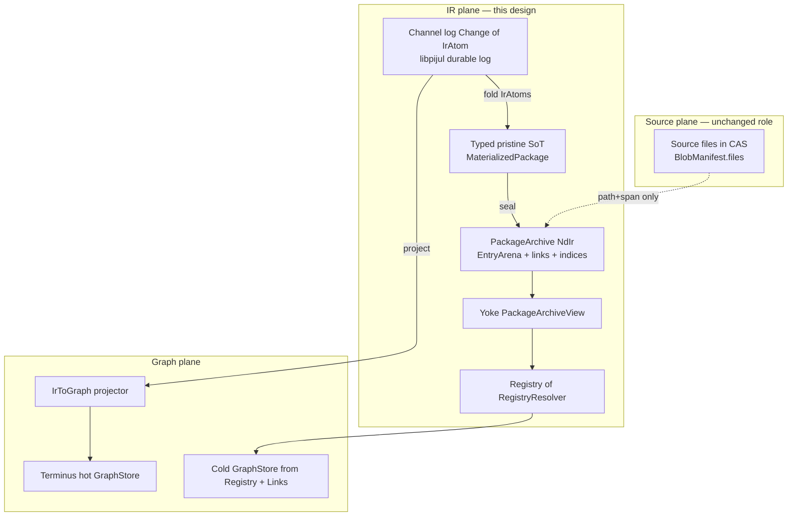
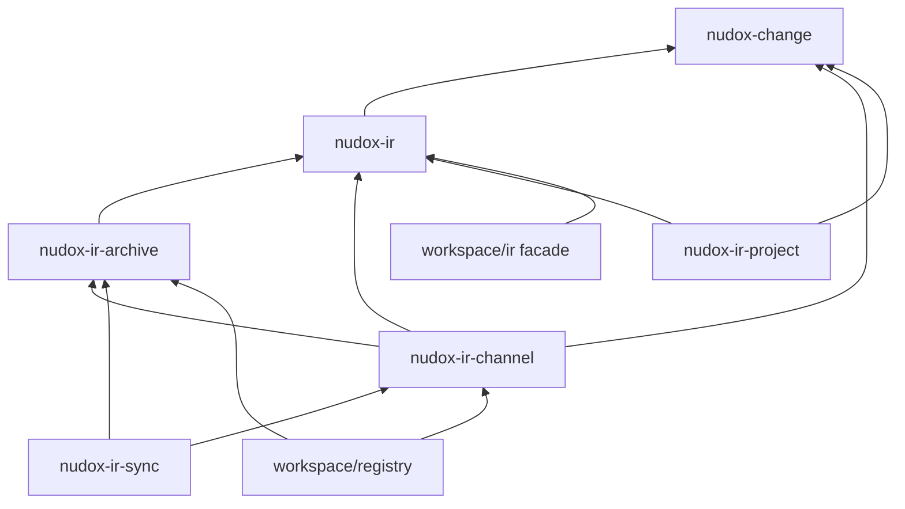
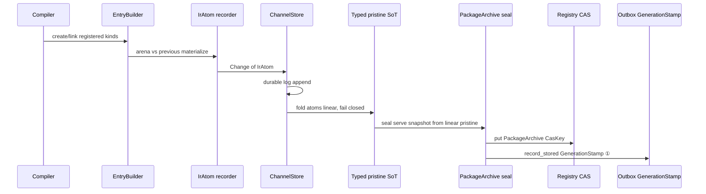
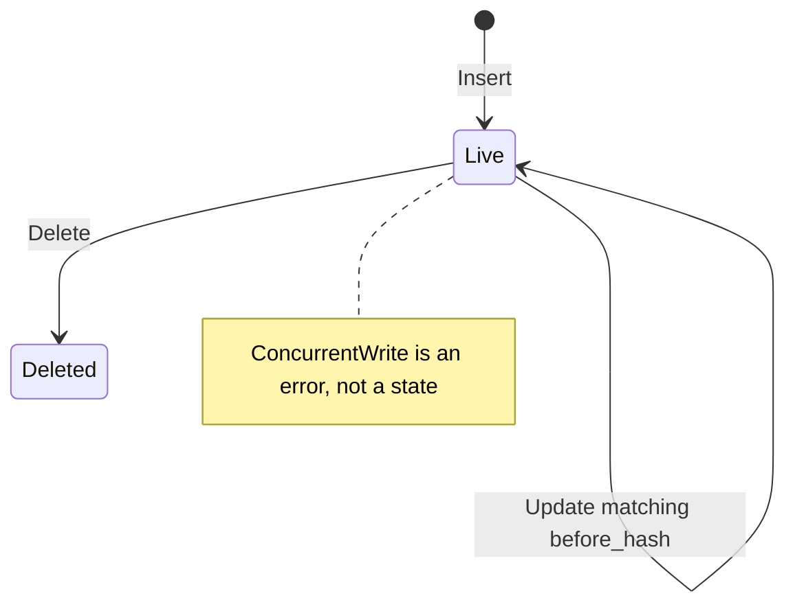

# IR-Native VCS: Arena IR + Universal Change + GPL libpijul + IR-Only Yoke

| Field | Value |
|---|---|
| **Title** | IR-Native VCS for Nudox: Arena-Indexed `nudox-ir`, Universal Change Algebra, PackageArchive, libpijul Channel Backend |
| **Author** | Architecture / Platform |
| **Date** | 2026-07-16 |
| **Status** | **Draft Rev 3.2** — Greenfield arena IR + universal Change; no dual-write; no conflicted pristine |
| **Audience** | Senior engineers (heart / registry / compiler / server / client / Terminus path) |
| **Supersedes** | Rev 3.1 dual-write / conflicted-pristine / postcard cutover; Rev 2.x entirely as VCS target |
| **Authoritative IR target** | `docs/research/ir-vcs/briefs/06-new-ir-rewrite.md` + crate sketch `nudox-ir` |
| **Research briefs** | `01` pijul · `02` zero-copy · `03` existing system · `04` diff/search · `05` prior art · `06` IR rewrite |
| **License posture** | **GPL is fine**; prefer **libpijul** for durable channel log behind typed `ChannelStore` |

---

## Overview

This design is **greenfield for the IR plane**: we build arena-indexed IR, PackageArchive, and a change log as the sole durable IR form. There is **no dual-write** with postcard `Index`, no Tier-B “lossy adapter,” and no production cutover ladder from an old IR store. Live `workspace/ir` may still exist in the monorepo for other work; it is **not** a migration source we must carry. The model stays **migration-capable later** via versioned formats (`format_version`, `type_hash`, versioned change envelope, stable `IntroId`) — not via parallel fallbacks.

1. **Target IR = arena-indexed `nudox-ir`** — `Entry` = `Symbol` + `Node` + `EntryInner`, `EntryIdx<T: EntryKind>`, `Registry` + `RegistryResolver`, undirected `EntryLink`, `register_kinds!`.
2. **Yoke is ONLY for IR.** Source bodies live in the **existing source CAS** (`BlobManifest.files`). The IR archive never embeds source text.
3. **Resolution, lookup, networking, efficient IR sync** live in this representation (PackageArchive indices, change log, channel tips, IR want/have). Source sync stays on the file CAS path.
4. **Change is universal** — `nudox-change` has **no** Terminus/HTTP deps. Same envelope serves IR lineage and Terminus incremental publish.
5. **Extremely strongly typed Rust** — newtypes everywhere; no raw symbol-key strings; no `serde_json::Value` on core paths; phantom kinds; sealed `EntryKind` **inside** `nudox-ir` only; **public unsealed `Atom`**; POD/`zerocopy` headers; `thiserror` enums.
6. **GPL OK → libpijul** for durable change log / channel membership. **Semantic SoT = typed EntryArena materialize**, never synthetic file paths as product ontology.
7. **Single-writer, linear channels.** Concurrent edits on the same intro are a **lock/publish bug**, not a product state. No conflicted pristine, no dual-write, no Index fallback.



---

## Background & Motivation

### Target ontology (brief 06)

| Concept | Role |
|---|---|
| `EntryArena` per package | Durable package IR unit |
| `EntryIdx<T>` / `RawEntryIdx` | Generation-local typed pointers |
| `IntroId` / `StableRef` | Cross-generation / wire identity |
| `Node { parent, children }` | Explicit tree |
| `EntryInner::Reference` | Re-exports with own `Symbol` |
| `EntryLink` + LinkCSR | Graph without Terminus |
| `Registry<R: RegistryResolver>` | Multi-package resolve + remote fill |

### Related live code (context only — not a cutover obligation)

If `workspace/ir` / postcard Index still exist elsewhere in the monorepo, they are **out of scope** for this IR plane. We do **not** dual-write or build Tier-B adapters. When/if old blobs appear later, a **one-shot offline importer** can be written against versioned formats — not part of the steady-state architecture.

**Still do:** type `GenerationStamp` vs `CasKey` correctly from day one (outbox must store `GenerationStamp` only) so we never reintroduce the Hash ①/② confusion.

### Product problems solved

Symbol-level lineage; zero-copy name/type/link lookup; cross-package resolve with remote fill; incremental Terminus publish; efficient IR sync of change tails + archives.

---

## Key Decisions (binding, complete)

| ID | Decision | Rationale |
|---|---|---|
| **K1** | Target IR = **`nudox-ir` arena model** (brief 06). **Greenfield** IR plane — no dual-write with any legacy Index. | Ship the end state. |
| **K2** | **Yoke is IR-only.** `Symbol.source_path: StrId` + `ByteSpan`; bodies in source CAS. Never yoke tar/text. | Working set + threat model. |
| **K3** | **PackageArchive = IR only** (arena + links + indices + strings). No file bodies, no CST. | Clear CAS roles. |
| **K4** | Universal algebra in **`nudox-change`** (no Terminus/HTTP). `Change<A: Atom>` envelope. | One apply/inverse story. |
| **K5** | **`IrAtom` keyed by `IntroId`**, never generation-local `ArenaIdx` alone. | Cross-version identity. |
| **K6** | Terminus: **`GraphAtom`** in same envelope; pure `IrToGraph`. | Incremental publish. |
| **K7** | **GPL OK.** libpijul for **durable change log + channel membership + tip fingerprint**. | Reuse plumbing. |
| **K8** | **`trait ChannelStore`**; **`LibpijulChannelStore`**. **Typed EntryArena materialize is semantic SoT**; libpijul never interpreted as source files. | Issue 9. |
| **K9** | **`RegistryResolver` = sync/network boundary.** LocalDisk → RemoteIndex → Composite + `heart::cache::SingleFlight`. | Brief 06 + live SingleFlight. |
| **K10** | Within generation: `EntryIdx<T>`. Across gen/changes/wire: `IntroId` / `StableRef` / `ProductionEntryId`. | Brief 06 serde. |
| **K11** | Archive: sectional POD TOC + rkyv/POD payloads; format_version + type_hash; regenerate on break. | Brief 02. |
| **K12** | Dual-hash newtypes: `GenerationStamp` ≠ `CasKey` ≠ `ChangeId` ≠ `ContentBlake3`. **Outbox stores GenerationStamp only.** | Brief 03 C1; Issue 5. |
| **K13** | Channel tip equality: **`ChangeSetFingerprint`** (v1 sorted blake3 of ChangeIds). Optional libpijul Merkle exposed as same newtype when backend provides it. Equality-only for v1 set recon — HaveChanges uses **explicit ChangeId sets**. | Issue 17. |
| **K14** | **Single-writer linear apply only.** One writer per channel; concurrent domain overlap is **`ApplyError::ConcurrentWrite`** (bug), not conflicted pristine. No `MaterializedEntry::Conflict`, no serve-time conflict policies. | Product never multi-masters dep IR. |
| **K15** | No `serde_json::Value` on core paths. Meta is postcard/typed structs. | Strong typing. |
| **K16** | Fold name + type skeleton + link CSR into archive; occurrences optional section. | Serve vs bulk. |
| **K17** | Cold `GraphStore` over Registry + PackageArchive + LinkCSR; hot Terminus. | GD-8. |
| **K18** | `IntroId` stable for life after first Insert. Bootstrap from **parent name chain + name + kind + overload disambiguator**. Renames do not change IntroId. | Issue 14. |
| **K19** | Frontend builders → `EntryBuilder`; producers emit arena → seal → record vs tip. | Brief 06. |
| **K20** | Async only on `ensure_package` / resolver load; sync accessors require package resident. | Issue 11. |
| **K21** | **`Atom` is public and unsealed.** External crates implement freely; orphan-rule discipline documented. | Issue 2. |
| **K22** | **Within-change atom total order** (Deletes → Updates/Retargets → Inserts topo → LinkRemove → LinkAdd → Reparent). Auto-normalize on build; reject illegal residual. | Deterministic ChangeId. |
| **K23** | **Generation Ready ⇔ RequiredClosure present and verified.** IR change-log sync is subordinate to generation closure for client Ready. | Issue 4. |
| **K24** | Kinds grow with `register_kinds!` as frontends need them. **No** Unported bucket, **no** dual-write, **no** postcard Index path in this plane. | Greenfield honesty. |
| **K25** | **Tree edges SoT = parent field on entry** (+ CSR rebuild). `OwnedEntryPayload` does **not** own a competing children list as wire SoT; children derived. `Reparent` is the tree-edge atom. | Issue 8. |
| **K26** | **One writer per `(PackageLineageId, ChannelName)`**; lock-free mmap readers. | Issue 18. |
| **K27** | **Forbidden in Change/wire payloads:** `ArenaIdx`, `PackageIdx`, `RawEntryIdx`, `StrId`, `LinkId`. Only `IntroId`, `StableRef`, digests, ids. | Issue 13. |
| **K28** | **Future migrations only via versioned formats** (`PackageArchive.format_version`, change envelope version, `type_hash`). No parallel fallback stores. Optional offline importers later. | Migration-capable, not dual-path. |

---

## Goals and Non-Goals

### Goals

- Content-addressed **PackageArchive** per package generation (IR-only).
- **Change log** of `Change<IrAtom>` with linear single-writer apply and unrecord.
- **libpijul-backed** durable log (primary) behind `ChannelStore`.
- **RegistryResolver** local + remote IR fetch.
- Zero-copy **yoke** over PackageArchive.
- Universal **nudox-change** shared with Terminus projection.
- Generation **RequiredClosure** / Ready integrated with IR tip.
- Versioned formats so a **future** one-shot migration is possible without redesign.

### Non-Goals

- Replacing source CAS or source sync.
- Terminus as IR store.
- Synthetic paths as product semantics.
- Multi-language zero-copy of PackageArchive.
- **Dual-write** with postcard Index or any legacy IR blob.
- **Conflicted pristine** / multi-master channel merge for package IR.
- **Tier-B Unported adapters** or language-gated Index drop ladders.
- In-place silent schema evolution (bump `format_version` + re-seal instead).
- v1 progressive IntroId subgraph fetch (deferred v2).
- Building every language Kind on day one (add kinds when frontends need them).

---

## Architecture

### Crate map and repo placement (Issue 19)

```text
# New crates (Cargo workspace members under crates/ or workspace/ as monorepo convention allows)
nudox-change          # Atom (public unsealed), Change, laws, ChangeSetFingerprint — NO terminus/http/ir
nudox-ir              # Entry, Node, Kind, EntryIdx, Registry, EntryBuilder, IrAtom, KindWire
nudox-ir-archive      # PackageArchive seal/open, yoke, indices
nudox-ir-channel      # ChannelStore, InMemoryChannelStore, LibpijulChannelStore (GPL boundary)
nudox-ir-sync         # Wire protocol, RemoteIndexResolver, RequiredClosure checks
nudox-ir-project      # IrToGraph, cold GraphStore, SymbolId join
workspace/registry    # BlobManifest, CAS, emit — extended; outbox GenerationStamp fix
workspace/server      # Thin HTTP for IR sync + /v1/sync/plan integration
workspace/ir          # MIGRATION FACADE: re-exports nudox-ir types progressively;
                      # optional thin re-export; not a dual-write peer
```

**Dependency rule:** `nudox-change` at bottom. `IrAtom` lives in **`nudox-ir`** (needs KindDiscriminant / StableRef) and implements `nudox_change::Atom`. `GraphAtom` lives in **`nudox-ir-project`** (or `nudox-change` graph feature module without Terminus client) and implements `Atom`. libpijul types **must not** be `pub use`’d from `nudox-ir` or `nudox-change`.



### End-to-end data flow



### Planes of identity (do not collapse)

| Plane | Type | Scope | Role |
|---|---|---|---|
| Generation-local arena | `ArenaIdx` | One PackageArchive | Column index |
| Registry-session | `PackageIdx` | One `RegistryState` process | Remapped every `ensure_package` |
| Typed handle | `EntryIdx<T>` | Session + generation | Typed access |
| Introduction | `IntroId` | Forever after Insert | Change keys, blame |
| Wire / foreign | `StableRef` / `ProductionEntryId` | Cross package | Serde, re-exports |
| Entry payload hash | `ContentBlake3` | Content | Linear before_hash expectations |
| Package archive CAS | `CasKey` | Exact bytes | CAS address (Hash ② domain for objects) |
| Logical generation | `GenerationStamp` | Snapshot identity ① | Audits, outbox, Ready |
| Change object | `ChangeId` | Forever | Channel membership |
| Channel tip equality | `ChangeSetFingerprint` | Applied ChangeId set | Tip equality (not set-diff alone) |

#### Forbid-list (Issue 13) — type-level / module visibility

**Must never appear in `Change<A>`, wire sync payloads, or cross-process serde of IR deltas:**

`ArenaIdx`, `PackageIdx`, `EntryIdx<_>`, `RawEntryIdx`, `StrId`, `LinkId`, `TypeFingerprintId` (archive-local).

**Allowed:** `IntroId`, `StableRef`, `ProductionEntryId`, `ContentBlake3`, `CasKey`, `ChangeId`, `ChangeSetFingerprint`, `GenerationStamp`, `KindDiscriminant` (`u16`), `KindWire`, `ByteSpan` with path as owned/wire string or lineage-relative path bytes (not StrId).

`PackageIdx` is **remapped on every `ensure_package`**; never seal it into archives or changes.

---

## Type-Level Safety Notes

### Core newtypes

```rust
use core::marker::PhantomData;
use smol_str::SmolStr;
use thiserror::Error;
use zerocopy::{FromBytes, Immutable, IntoBytes, KnownLayout};

/// BLAKE3-256 of a **domain-tagged** canonical preimage. Not a CasKey/ChangeId/etc.
#[derive(Clone, Copy, PartialEq, Eq, Hash, PartialOrd, Ord)]
#[repr(transparent)]
pub struct ContentBlake3([u8; 32]);

#[derive(Clone, Copy, PartialEq, Eq, Hash)]
#[repr(transparent)]
pub struct CasKey(ContentBlake3);

#[derive(Clone, Copy, PartialEq, Eq, Hash)]
#[repr(transparent)]
pub struct GenerationStamp(ContentBlake3);

#[derive(Clone, Copy, PartialEq, Eq, Hash, PartialOrd, Ord)]
#[repr(transparent)]
pub struct ChangeId(ContentBlake3);

/// Equality-only fingerprint of an applied change set (v1: blake3 of sorted ChangeIds + domain tag).
/// Not sufficient alone for set reconciliation (Issue 17).
#[derive(Clone, Copy, PartialEq, Eq, Hash)]
#[repr(transparent)]
pub struct ChangeSetFingerprint(ContentBlake3);

/// Alias used at ChannelStore tip API — same bits as ChangeSetFingerprint in v1.
pub type MerkleState = ChangeSetFingerprint;

#[derive(Clone, Copy, PartialEq, Eq, Hash, PartialOrd, Ord)]
#[repr(transparent)]
pub struct IntroId(ContentBlake3);

#[derive(Clone, Copy, PartialEq, Eq, Hash, PartialOrd, Ord)]
#[repr(transparent)]
pub struct StrId(u32);

#[derive(Clone, Copy, PartialEq, Eq, Hash)]
#[repr(transparent)]
pub struct LinkId(u32);

#[derive(Clone, Copy, PartialEq, Eq, Hash)]
#[repr(transparent)]
pub struct TypeFingerprintId(u32);

#[derive(Clone, PartialEq, Eq, Hash)]
pub struct ChannelName(SmolStr);

#[derive(Clone, Copy, PartialEq, Eq, Hash)]
#[repr(transparent)]
pub struct ChannelId(u128);

/// Domain-separated author identity: blake3("nudox.author.v1" || pubkey_or_email_bytes).
#[derive(Clone, Copy, PartialEq, Eq, Hash)]
#[repr(transparent)]
pub struct AuthorId(ContentBlake3);

#[derive(Clone, Copy, PartialEq, Eq)]
#[repr(transparent)]
pub struct TimestampUnixMs(u64);

#[derive(Clone, PartialEq, Eq, Hash)]
pub struct ChangeMessage(SmolStr);

#[derive(Clone, PartialEq, Eq, Hash)]
pub struct EcosystemId(SmolStr);

#[derive(Clone, PartialEq, Eq, Hash)]
pub struct PackageName(SmolStr);

#[derive(Clone, PartialEq, Eq, Hash)]
pub struct PackageLineageId {
    pub ecosystem: EcosystemId,
    pub name: PackageName,
}

/// Wire-stable cross-package entry reference: lineage + intro. This is the
/// ONLY cross-package reference form allowed in Change payloads and archives.
/// Canonical bytes (for hash preimages such as LinkDomainKey):
///   encode_str(ecosystem) || encode_str(name) || intro_bytes(32)
/// where encode_str = u32le(len) || utf8.
#[derive(Clone, PartialEq, Eq, Hash, PartialOrd, Ord, Serialize, Deserialize)]
pub struct StableRef {
    pub package: PackageLineageId,
    pub intro: IntroId,
}

/// Join table module `nudox_ir::package_id_join`:
/// PackageLineageId ↔ heart::PackageId (UUID), bijective, from registry metadata.
/// Brief-06's path-based `PackageId` is POC/test identity only — production
/// Registry APIs key on `PackageLineageId` everywhere in this design.
```

### DomainKey — typed, non-colliding (Issue 12)

```rust
/// Domain keys for conflict partition. Never a bare blake3 alone.
#[derive(Clone, Copy, PartialEq, Eq, Hash, Debug)]
pub enum DomainKey {
    Intro(IntroId),
    Link(LinkDomainKey),
    GraphDoc(GraphDocId),
    GraphRelation(GraphRelationId),
}

#[derive(Clone, Copy, PartialEq, Eq, Hash, Debug)]
pub struct LinkDomainKey(ContentBlake3);
// LinkDomainKey = blake3("nudox.link.v1" || min(a)||max(a)||ka||kb) with StableRef canonical bytes

impl DomainKey {
    pub fn conflicts_with_key(self, other: Self) -> bool {
        self == other
    }
}
```

### Graph identity — not SmolStr (Issue 12)

```rust
/// Validated Terminus / linked-data document identity (IRI or EntityIDFor).
#[derive(Clone, PartialEq, Eq, Hash)]
pub struct GraphDocId {
    // internal: validated string; constructors fallible
    repr: GraphIri,
}

#[derive(Clone, PartialEq, Eq, Hash)]
pub struct GraphRelationId {
    repr: GraphIri,
}

#[derive(Clone, PartialEq, Eq, Hash)]
struct GraphIri(SmolStr); // private; only via GraphDocId::parse / from_symbol_iri

impl GraphDocId {
    pub fn parse(s: &str) -> Result<Self, GraphIdError> { /* require scheme or known prefix */ }
    pub fn from_intro(policy: &IriPolicy, package: &PackageLineageId, intro: IntroId) -> Self { … }
}
```

### Arena indices

```rust
#[derive(Clone, Copy, PartialEq, Eq, PartialOrd, Ord, Hash)]
#[repr(transparent)]
pub struct PackageIdx(u32);

#[derive(Clone, Copy, PartialEq, Eq, PartialOrd, Ord, Hash)]
#[repr(transparent)]
pub struct ArenaIdx(u32);

pub struct EntryIdx<T: ?Sized> {
    package_idx: PackageIdx,
    arena_idx: ArenaIdx,
    _p: PhantomData<fn() -> T>,
}

pub struct UntypedMarker;
pub type RawEntryIdx = EntryIdx<UntypedMarker>;
```

### Entry model

```rust
pub struct Entry {
    pub sym: Symbol,
    pub node: Node,
    pub kind: EntryInner,
}

pub enum EntryInner {
    Owned(Kind),
    /// Re-export: own Symbol/Node; body elsewhere.
    Reference(RawEntryIdx), // in-memory only; wire uses StableRef
}

pub struct Node {
    pub parent: Option<RawEntryIdx>,
    pub children: List<RawEntryIdx>, // derived in builder; rebuildable from parent edges
}

pub type List<T> = Box<[T]>;
```

### Symbol — full parity with live fields (Issue 7)

Live `Symbol<T>` shell carries: name, path, **aliases**, visibility, documentation, **deprecation**, **doc_links**, inner.

**Target archive + logical Symbol:**

```rust
#[derive(Clone, PartialEq, Eq)]
pub struct Symbol {
    pub name: StrId,
    pub visibility: Visibility,
    pub documentation: Option<StrId>,
    /// Path reference into source CAS join key — NEVER file bytes.
    pub source_path: StrId,
    pub span: ByteSpan,
    /// Alternate names for lookup / search (interned).
    pub aliases: List<StrId>,
    pub deprecation: Option<Deprecation>,
    /// Doc cross-links; also emitted as EntryLinks where appropriate.
    pub doc_links: List<DocLink>,
}

#[derive(Clone, PartialEq, Eq)]
pub struct Deprecation {
    pub note: Option<StrId>,
    pub since: Option<StrId>,
}

#[derive(Clone, PartialEq, Eq)]
pub struct DocLink {
    pub target: StableRef, // wire; in-memory may be RawEntryIdx via resolver
    pub label: Option<StrId>,
}

/// Align with live visibility set (workspace/ir kind shell).
#[derive(Clone, Copy, PartialEq, Eq, Hash)]
#[repr(u8)]
pub enum Visibility {
    Public = 0,
    Private = 1,
    Protected = 2,
    Internal = 3,
    Package = 4,
    Crate = 5, // rust-specific; map from live when present
}

#[derive(Clone, Copy, PartialEq, Eq, Hash)]
#[repr(C)]
pub struct ByteSpan {
    pub start: u32,
    pub end: u32,
}
```

**Builder twin** (`SymbolBuf`): `String` / `PathBuf` / `Vec<String>` aliases — seal interns all strings into StringTable including aliases, deprecation notes, doc_link labels.

**EntryHead** must carry or side-column:

- aliases postings → **AliasIndex** section (name/alias StrId → ArenaIdx multi-map), merged into NameIndex queries
- deprecation flag bit + payload off
- doc_links in payload or LinkCSR with a DocLink kind tag

### KindDiscriminant — `u16` everywhere (Issue 12)

```rust
/// Generated by register_kinds!; stable wire order.
#[derive(Clone, Copy, PartialEq, Eq, Hash, Serialize, Deserialize)]
#[repr(u16)]
pub enum KindDiscriminant {
    Module = 1,
    Record = 2,
    Field = 3,
    Function = 4,
    Type = 5,
    // further variants assigned by register_kinds! in declaration order
}

// EntryHead.kind_disc: u16 (not u8)
```

Brief 06's `register_kinds!` POC generates `KindDiscriminant` without explicit values or `#[repr(u16)]`. Extend the macro to assign explicit `u16` values in declaration order (`= 1, = 2, …`), **append-only** — the enum above shows the result for the PR-1 kind set.

### KindWire (Issue 10)

```rust
/// Wire/on-disk kind payload: NO ArenaIdx. Edges are IntroId or StableRef only.
/// Discriminant order matches KindDiscriminant / register_kinds! version table.
#[derive(Clone, PartialEq, Eq, Serialize, Deserialize)]
pub enum KindWire {
    Module(ModuleWire),
    Record(RecordWire),
    Field(FieldWire),
    Function(FunctionWire),
    Type(TypeWire),
    // Add variants with register_kinds! — never a catch-all dump bucket.
}

#[derive(Clone, PartialEq, Eq, Serialize, Deserialize)]
pub struct RecordWire {
    pub fields: Box<[IntroId]>, // same-package intros; foreign use StableRef lists if needed
}

#[derive(Clone, PartialEq, Eq, Serialize, Deserialize)]
pub struct FunctionWire {
    pub input_params: Box<[ParamWire]>,
    pub output_params: Box<[ParamWire]>,
}

// Primitive lifetimes/builtins in TypeWire use StrId only after intern in archive;
// on Change wire use length-prefixed UTF-8 with domain tags in hash preimage (no free bare String in hash).
```

**Versioned discriminant table** in Meta section: `kind_table_version: u16` + optional rename map. Adding kinds appends new `u16` values; never reorder.

### Reference layout (Issue 10)

```rust
// EntryHead.flags bit 0 = IS_REFERENCE
// If IS_REFERENCE:
//   payload = ReferencePayload { target: StableRef } //  package lineage + IntroId
// else:
//   payload = KindWire
```

### Errors

```rust
#[derive(Debug, Error)]
pub enum ResolveError {
    #[error("package not loaded: {0:?}")]
    PackageNotLoaded(PackageLineageId),
    #[error("unknown intro {intro:?} in package {package:?}")]
    UnknownIntro { package: PackageLineageId, intro: IntroId },
    #[error("kind mismatch: expected {expected:?}, found {found:?}")]
    KindMismatch { expected: KindDiscriminant, found: KindDiscriminant },
    #[error("archive format {found} unsupported (max {max})")]
    UnsupportedFormat { found: u16, max: u16 },
    #[error("section too large: {section:?} uncompressed {got} > max {max}")]
    SectionTooLarge { section: SectionId, got: u64, max: u64 },
    #[error(transparent)]
    Io(#[from] std::io::Error),
    #[error(transparent)]
    Cas(#[from] CasError),
}

#[derive(Debug, Error)]
pub enum ApplyError {
    #[error("missing dependency {0:?}")]
    MissingDependency(ChangeId),
    #[error("before_hash mismatch for {intro:?}")]
    BeforeHashMismatch {
        intro: IntroId,
        expected: ContentBlake3,
        actual: ContentBlake3,
    },
    #[error("concurrent write on channel (lock violated or stale tip)")]
    ConcurrentWrite,
    #[error("channel locked")]
    ChannelLocked,
    #[error("duplicate insert intro: {0:?}")]
    DuplicateIntro(IntroId),
    #[error("missing intro for update/delete: {0:?}")]
    MissingIntro(IntroId),
    #[error("atom order invalid after normalization: {0}")]
    InvalidAtomOrder(AtomOrderError),
    #[error("change already applied: {0:?}")]
    AlreadyApplied(ChangeId), // or silent no-op per law 6 — prefer no-op + report
    #[error("link endpoint missing or deleted: {0:?}")]
    LinkEndpointMissing(StableRef),
    #[error("update on deleted intro: {0:?}")]
    UpdateDeleted(IntroId),
}
```

### POD headers

```rust
#[derive(Clone, Copy, FromBytes, IntoBytes, KnownLayout, Immutable)]
#[repr(C)]
pub struct ArchiveHeader {
    pub magic: [u8; 4],          // b"NdIr"
    pub format_version: u16,
    pub flags: u16,
    pub type_hash: [u8; 8],
    pub header_crc32: u32,
    pub toc_offset: u64,
    pub toc_len: u64,
    pub entry_count: u32,
    pub string_count: u32,
    pub link_count: u32,
    pub kind_table_version: u16,
    pub reserved: u16,
}

#[derive(Clone, Copy, FromBytes, IntoBytes, KnownLayout, Immutable)]
#[repr(C)]
pub struct TocEntry {
    pub section_id: u32, // validated → SectionId on open
    pub offset: u64,
    pub length: u64,
    pub uncompressed_crc32: u32,
    pub reserved: u32,
}

#[derive(Clone, Copy, FromBytes, IntoBytes, KnownLayout, Immutable)]
#[repr(C)]
pub struct EntryHead {
    pub intro: [u8; 32],
    pub name: u32,              // StrId
    pub source_path: u32,       // StrId
    pub span_start: u32,
    pub span_end: u32,
    pub visibility: u8,
    pub flags: u8,              // bit0 IS_REFERENCE, bit1 HAS_DEPRECATION, …
    pub kind_disc: u16,         // KindDiscriminant as u16
    pub parent: u32,            // ArenaIdx or u32::MAX
    pub payload_off: u32,
    pub payload_len: u32,
}

/// Validation constants (Issue 10)
pub const MAX_SECTION_UNCOMPRESSED: u64 = 512 * 1024 * 1024; // 512 MiB
pub const MAX_ENTRIES: u32 = 50_000_000;
pub const MAX_STRING_BLOB: u64 = 256 * 1024 * 1024;
```

All multi-byte integers in headers/string table offsets: **little-endian**.

---

## Universal Change Algebra (normative)

### Crate: `nudox-change`

No dependency on Terminus, HTTP, or `nudox-ir`.

### Atom — public, **unsealed** (Issue 2)

```rust
use serde::{de::DeserializeOwned, Serialize};

/// Primitive invertible operation. **Not sealed** — implement in downstream crates.
///
/// Orphan-rule discipline: implement `Atom` only for types defined in your crate
/// (e.g. `IrAtom` in `nudox-ir`, `GraphAtom` in `nudox-ir-project`).
pub trait Atom: Clone + Eq + Serialize + DeserializeOwned {
    type Target;
    type Context;
    type Error: std::error::Error + Send + Sync + 'static;

    fn inverse(&self) -> Self;

    /// True if the pair is not free to commute (domain coupling).
    fn conflicts_with(&self, other: &Self) -> bool;

    fn domain_keys(&self) -> Box<[DomainKey]>;
}

/// Test helper macro (provided by nudox-change):
/// `assert_inverse_law!(atom, apply_fn)` / `assert_commute!(a, b, apply_fn)`
```

**Extensibility rule (crate map):** laws and `Change<A>` live in `nudox-change`. Concrete atoms live next to their domain types. Do **not** re-seal `Atom`.

### Change envelope

```rust
#[derive(Clone, PartialEq, Eq, Serialize, Deserialize)]
pub struct Change<A: Atom> {
    pub id: ChangeId,
    pub header: ChangeHeader,
    pub deps: Box<[ChangeId]>,
    pub extra_known: Box<[ChangeId]>,
    /// Atoms in **normalized total order** (see Within-change atom order).
    pub atoms: Box<[A]>,
    pub contents: ContentsRef,
}

#[derive(Clone, PartialEq, Eq, Serialize, Deserialize)]
pub struct ChangeHeader {
    pub authors: Box<[AuthorId]>,
    pub message: ChangeMessage,
    pub timestamp: TimestampUnixMs,
    pub target_kind: TargetKindDiscriminant,
}

#[derive(Clone, Copy, PartialEq, Eq, Serialize, Deserialize)]
#[repr(u16)]
pub enum TargetKindDiscriminant {
    IrPackage = 1,
    GraphCorpus = 2,
}

#[derive(Clone, PartialEq, Eq, Serialize, Deserialize)]
pub enum ContentsRef {
    Inline(Box<[u8]>),
    Cas(CasKey),
    Empty,
}
```

`ChangeId = blake3("nudox-change/v1" || canonical(header, deps, extra_known, atoms, contents_hash))`.

### Within-change atom order (Issue 3) — **normative**

Atoms inside one `Change` are a sequence. **Producers and `Change::build` MUST normalize** to this total order before sealing `ChangeId`:

| Phase | Order | Atoms | Rule |
|---|---|---|---|
| 1 | **Deletes** | `Delete` | **Deepest-first** (children before parents) using parent edges implied by payload/`extra` or recorded parent IntroId |
| 2 | **Updates / Retargets** | `Update`, `Retarget` | Any order among themselves; same-intro coalesced by builder when possible |
| 3 | **Inserts** | `Insert` | **Parents before children** (topo order on parent IntroId edges declared in Insert) |
| 4 | **LinkRemove** | `LinkRemove` | After Deletes that remove endpoints (Deletes already ran) |
| 5 | **LinkAdd** | `LinkAdd` | Endpoints must exist after phases 1–3 (in pristine or earlier Insert in this change) |
| 6 | **Reparent** | `Reparent` | After Inserts of both nodes |

**Apply algorithm:**

1. Normalize atom list (or **reject** `ApplyError::InvalidAtomOrder` if `strict_order` and not normalized).
2. Apply **left-to-right** single pass after normalization (topo guarantees make multi-pass unnecessary for Inserts).
3. **Inverse** of a change = reverse atom order, each atom inverted (phase order reverses naturally).

**Validation gate:** record `Point{x,y}` → apply on empty → materialize tree equals builder output (structure + intros).

**Intra-change references:** an Insert may reference sibling intros that appear **later in the pre-normalized list**; after normalization, parents precede children. LinkAdd never references intros not present after phase 3 of the **same** change or already in pristine.

### Linear single-writer apply (normative)

**Product rule:** package IR channels are **single-writer**. Concurrent updates to the same `IntroId` (or overlapping domain keys without a total order via `deps`) are a **publish/lock bug**, not a first-class state.

#### Pristine entry state

```rust
/// Semantic materialization of one IntroId in the typed pristine SoT.
#[derive(Clone, PartialEq, Eq)]
pub enum MaterializedEntry {
    Live(OwnedEntryPayload),
    Deleted {
        last_hash: ContentBlake3,
        deleted_by: ChangeId,
    },
}

pub struct PristineIntroTable {
    map: FxHashMap<IntroId, MaterializedEntry>,
    links: FxHashMap<LinkDomainKey, LinkRecord>,
    /// Parent edges: child → Option<parent intro> (tree SoT).
    parent: FxHashMap<IntroId, Option<IntroId>>,
}
```

#### Apply rules

| Situation | Behavior |
|---|---|
| Writer lock held; `deps` present; `before_hash` matches live payload | Apply Update/Delete |
| `before_hash` ≠ live hash (linear tip) | **`ApplyError::BeforeHashMismatch`** — corrupt change or stale publisher |
| Another writer holds the channel lock | **`ApplyError::ChannelLocked`** (or queue) — never fork pristine |
| Two changes both claim same linear parent without serializing | **Must not happen** under K26; if detected offline, **`ApplyError::ConcurrentWrite`** and reject the second change — **do not** store conflict candidates |
| Re-apply same `ChangeId` | Idempotent no-op |

```text
apply Update(intro, before_hash, after):
  match pristine.get(intro):
    None → Error MissingIntro
    Deleted {..} → Error UpdateDeleted   // explicit resurrect is a future atom if ever needed
    Live(payload) if payload.hash != before_hash → Error BeforeHashMismatch
    Live(payload) if payload.hash == before_hash → set Live(after)
```

#### Delete / Link coupling

```text
apply Delete(intro, before_hash):
  validate before_hash
  remove all links with endpoint intro
  set Deleted { last_hash, deleted_by }
  clear parent edge; orphaned children keep parent=None until Reparent/Delete

apply LinkAdd(a,b,...):
  if either endpoint missing or Deleted → Error LinkEndpointMissing
  else add to links
```

#### Seal / Ready

Seal `PackageArchive` from the **unique** live pristine (all intros `Live` or `Deleted`). No serve-time conflict policy. Ready requires sealed archive + RequiredClosure.



### Normative laws

1. **Inverse (content):** apply \(A\) then \(A^{-1}\) restores content state on a linear channel.
2. **Dependency:** refuse apply if `deps` not all present on channel.
3. **Commutation (independent domains):** if no atom of \(A\) `conflicts_with` any of \(B\), content state and `ChangeSetFingerprint` are order-independent — useful for property tests and optional reordering of independent package channels, **not** multi-master merge of one channel.
4. **Associativity** of sequential apply under dep closure.
5. **Single-writer:** concurrent domain overlap is **rejected**, not stored.
6. **Idempotent re-apply** of same `ChangeId` is no-op.

### IrAtom

```rust
#[derive(Clone, PartialEq, Eq, Serialize, Deserialize)]
pub enum IrAtom {
    Insert {
        intro: IntroId,
        entry: OwnedEntryPayload,
        /// Tree edge at introduction (SoT). None = root.
        parent: Option<IntroId>,
    },
    Update {
        intro: IntroId,
        /// Linear expectation; concurrent path uses as blame only.
        before_hash: ContentBlake3,
        after: OwnedEntryPayload,
    },
    Delete {
        intro: IntroId,
        before_hash: ContentBlake3,
    },
    Retarget {
        intro: IntroId,
        from: StableRef,
        to: StableRef,
    },
    LinkAdd {
        a: StableRef,
        b: StableRef,
        kind_a: KindDiscriminant,
        kind_b: KindDiscriminant,
    },
    LinkRemove {
        a: StableRef,
        b: StableRef,
        kind_a: KindDiscriminant,
        kind_b: KindDiscriminant,
    },
    Reparent {
        intro: IntroId,
        old_parent: Option<IntroId>,
        new_parent: Option<IntroId>,
    },
}

#[derive(Clone, PartialEq, Eq, Serialize, Deserialize)]
pub struct OwnedEntryPayload {
    pub symbol: SymbolWire, // names/paths as length-prefixed strings; aliases; deprecation; doc_links as StableRef
    pub kind_disc: KindDiscriminant,
    pub kind: KindWire,     // IntroId edges only — no children list SoT
    pub flags: EntryPayloadFlags,
    pub payload_hash: ContentBlake3,
}

// NO children: Box<[IntroId]> as wire SoT — tree via parent map + Reparent/Insert.parent (K25)
```

#### Domain keys

| Atom | DomainKey(s) |
|---|---|
| Insert/Update/Delete/Retarget/Reparent | `DomainKey::Intro(intro)` |
| LinkAdd/LinkRemove | `DomainKey::Link(link_key(a,b,ka,kb))` |

#### `conflicts_with` coupling table (Issue 8) — **normative**

| A | B | conflicts_with? | Notes |
|---|---|---|---|
| Update/Delete/Retarget same intro | same | **yes** | Concurrent domain → ConcurrentWrite if not linearized by lock |
| Insert same intro | Insert same | **yes** | DuplicateInsert error |
| LinkAdd/Remove same link key | same | **yes** | |
| Delete(intro) | LinkAdd endpoint intro | **yes** | `DeleteWithLiveLinks` / endpoint missing |
| Delete(intro) | LinkRemove endpoint | **no** | LinkRemove ∩ Delete commute if LinkRemove first in order; Delete implies link purge |
| Reparent(intro) | Update(intro) | **yes** | Same intro domain |
| Reparent(intro) | Update(other) | **no** if other ≠ intro and ≠ parents involved |
| Reparent(intro) | Delete(intro) | **yes** | |
| LinkAdd | Insert of endpoint in other change | **yes** if endpoint missing without Insert dep; **no** if Insert dep ensures existence |
| Retarget | Update same intro | **yes** | Prefer single Update carrying Reference kind |
| Independent intros + disjoint links | | **no** | Commute |

**Implied side effects (coupling rules, not separate atoms):**

1. **`Delete(intro)`** removes all incident live links (as if LinkRemove for each). Inverse re-adds from contents snapshot of purged links (must store in `contents` under before snapshot).
2. **`Reparent`** updates parent map only; CSR rebuilt on materialize/seal. Does not rewrite KindWire.
3. **`LinkAdd`/`LinkRemove`** validate endpoints exist as `Live` (not `Deleted`) after phases 1–3 of current change + pristine.
4. **`Retarget`** only valid when entry is Reference; if payload also embeds target, Retarget is the sole mutator of target (Update of Reference body without Retarget is forbidden by builder).

#### Inverse table

| Atom | Inverse |
|---|---|
| Insert | Delete { intro, before_hash: payload_hash } + restore links empty |
| Update | Update with before/after swapped; before body in contents |
| Delete | Insert + restore purged links from contents |
| Retarget | Retarget swapped from/to |
| LinkAdd | LinkRemove |
| LinkRemove | LinkAdd |
| Reparent | Reparent swapped parents |

### GraphAtom

```rust
#[derive(Clone, PartialEq, Eq, Serialize, Deserialize)]
pub enum GraphAtom {
    UpsertDocument {
        id: GraphDocId,
        before_hash: Option<ContentBlake3>, // None = insert; Some = update; body in contents
        after_hash: ContentBlake3,
    },
    DeleteDocument {
        id: GraphDocId,
        before_hash: ContentBlake3,
    },
    UpsertRelation {
        id: GraphRelationId,
        before_hash: Option<ContentBlake3>,
        after_hash: ContentBlake3,
    },
    DeleteRelation {
        id: GraphRelationId,
        before_hash: ContentBlake3,
    },
}
```

Same inverse recovery via contents as IR. `conflicts_with`: same GraphDocId/GraphRelationId domain.

**Projector law (Issue 8):** if IR changes \(A,B\) commute (disjoint domain keys), projected GraphAtoms may **coarsen** (multiple graph docs per intro). Commute is preserved **only when** projection maps domain keys injectively into graph domain keys. Documented exceptions: one Insert → many GraphAtoms that share no ids with another Insert’s projection. Property test: independent Insert intros → projected domain key sets disjoint.

### ChangeSetFingerprint v1 (Issue 17)

```text
ChangeSetFingerprint = blake3("nudox.cset.v1" || sort(ChangeId bytes concatenated))
```

- **Equality-only** tip check.
- **HaveChanges v1 payload:** explicit sorted `ChangeId` list (cap `MAX_HAVE_IDS = 10_000`); if larger, client sends fingerprint + requests **snapshot shortcut** (`GetArchive` + tip). Bloom deferred to v2 with documented k,m,false-positive.

---

## Generation Ready / RequiredClosure (Issue 4)

### Normative predicate

```text
RequiredClosure(G) =
    { FileEntry.content_hash for each files[] }
  ∪ { ir_package_ref }                    # PackageArchive CasKey
  ∪ { references_ref? if Some }
  ∪ { occurrences_ref? if Some }
  ∪ ChangeContentsBlobs(channel tip)      # every ContentsRef::Cas reachable from
                                          # changes in the applied set if archive
                                          # was built with externalized contents
  ∪ { change objects for tip if client
      materializes via change fold rather
      than GetArchive }

Ready(client, G) ⇔
    all hashes in RequiredClosure(G) present in local CAS
  ∧ blake3 verified
  ∧ optional: client channel ChangeSetFingerprint == manifest.change_set_ref.tip
```

**v1 rules:**

1. Client Ready for **serve IR** requires at least `ir_package_ref` archive + files needed for source join **if** UI needs source; pure IR browse can Ready with archive alone **but product Ready for package generation includes files[]** (generation identity includes sources).
2. **Change-tail apply without GetArchive** is enough to rebuild IR **only if** client runs full fold + seal locally; still must satisfy RequiredClosure for any externalized contents blobs.
3. Equal `ChangeSetFingerprint` does **not** alone imply equal `CasKey` of archive (seal determinism required — Issue 20) or equal `GenerationStamp` (includes files + toolchain). Generation identity remains Hash ①.
4. **No progressive IntroId fetch in v1.**

### RPC mapping

IR RPCs live **beside** planned `/v1/sync/plan` (GD-20/30), not as a forever-disconnected plane:

| IR RPC | Sync-plan relationship |
|---|---|
| `GetChannelTip` | May be embedded as section of plan response for package |
| `HaveChanges` / `GetChanges` | Optional delta path when client has prior generation |
| `GetArchive` | Satisfies `ir_package_ref` want |
| `GetChangeContents` | Part of RequiredClosure for contents CAS keys |
| Existing file CAS get | `files[]` wants |

---

## PackageArchive Layout (IR-only, byte-precise)

### Magic / media

- Magic `NdIr`; media `application/vnd.nudox.ir-package-archive`
- Replaces postcard Index under `ir_package_ref`

### Sections

| SectionId (u32) | Contents |
|---|---|
| 1 StringTable | LE offsets + UTF-8 blob |
| 2 EntryHeads | `EntryHead[entry_count]` |
| 3 EntryPayloads | KindWire / ReferencePayload |
| 4 IntroIndex | sorted `(IntroId, ArenaIdx)` |
| 5 NameIndex | name + **aliases** postings → ArenaIdx |
| 6 MonikerIndex | optional FQ segments |
| 7 TreeCSR | children CSR from parent map |
| 8 LinkCSR | bidirectional ends + kind discs |
| 9 TypeSkeletonIndex | fingerprint → postings |
| 10 IntroPayloadHash | per-entry payload `ContentBlake3` |
| 11 Meta | lineage, toolchain, kind_table_version, generation inputs |
| 12 KindDiscCol | dense u16[entry_count] optional |

**Forbidden in archive:** source bytes, tar, CST, Terminus docs, unbounded embeddings.

### Type skeleton (Issue 10) — byte-level sketch for goldens

```text
skeleton(TypeWire) -> bytes:
  walk type AST in fixed variant order
  emit opcode u8 per variant (TABLE v1)
  for named refs emit 0x01 || intro_bytes or 0x02 || stable_ref_bytes
  strip surface names of params; keep structure arity
TypeFingerprintId = first 4 bytes of blake3("nudox.tyskel.v1" || skeleton) as u32 LE

Opcode TABLE v1 (u8), one opcode per TypeWire variant:
  0x01 intro ref      || 32-byte IntroId
  0x02 foreign ref    || StableRef canonical bytes
  0x10 SelfType
  0x11 Primitive      || primitive sub-opcode
  0x12 Tuple          || u16le arity, then element encodings
  0x13 Slice          || element
  0x14 Array          || element || u64le length
  0x15 Union          || u16le arity, then elements
  0x16 Intersection   || u16le arity, then elements
  0x17 Never
  0x18 Any

Primitive sub-opcodes (u8):
  0x01 Integer || u8(signed) || width      0x02 Float || width
  0x03 Bool    0x04 Char    0x05 Str
  0x06 MutPointer || pointee               0x07 ConstPointer || pointee
  0x08 Reference || u8(mutable) || pointee   (lifetime name stripped)
  0x09 Builtin || encode_str(name)           (name kept: structural for builtins)

Width: 0x00 = Arch; 0x01 || u32le(bits) = Fixed.
```

Golden vectors committed under `nudox-ir-archive/tests/skel_goldens/`.

Brief 04's `TypeSkeleton { arity, node_count, rarest, shape_hash, … }` is the **search-side feature vector** and remains a search-crate concern; the opcode walk above is the **archive index fingerprint** and is normative here.

### Deterministic seal (Issue 20)

1. Sort entries by `IntroId` bytes before assigning ArenaIdx **or** assign ArenaIdx in builder order but sort all indices’ emission by IntroId for IntroIndex/Name postings.
2. Sort links by `LinkDomainKey`.
3. Sort string table by first-seen deterministic builder walk (preorder IntroId order).
4. Same intros + payloads + links ⇒ **identical CasKey**.

### Yoke API

```rust
pub struct YokedArchive {
    inner: yoke::Yoke<PackageArchiveView<'static>, Arc<[u8]>>,
}

impl<'a> PackageArchiveView<'a> {
    pub fn entry_head(&self, idx: ArenaIdx) -> Result<&'a EntryHead, ArchiveError>;
    pub fn intro_of(&self, idx: ArenaIdx) -> IntroId;
    pub fn lookup_name(&self, name: &str) -> impl Iterator<Item = ArenaIdx> + 'a; // includes aliases
    pub fn lookup_intro(&self, intro: IntroId) -> Option<ArenaIdx>;
    pub fn children(&self, idx: ArenaIdx) -> &'a [ArenaIdx];
    pub fn links(&self, idx: ArenaIdx) -> impl Iterator<Item = LinkEnd> + 'a;
    pub fn by_type_fingerprint(&self, fp: TypeFingerprintId) -> &'a [ArenaIdx];
    pub fn payload_raw(&self, idx: ArenaIdx) -> &'a [u8];
    pub fn kind_table_version(&self) -> u16;
}
```

**Never** yoke source tar.

---

## IntroId bootstrap (Issue 14)

### v1 normative bootstrap (first Insert only)

```text
segments = parent name chain from package root module to entry
           (each segment = Symbol.name at that node; NOT raw NudoxPath string)

disambiguator =
  if unique (lineage, kind, segments, name): empty
  else if function overload: blake3(type_skeleton of function signature)
  else: u64le(span.start) || u64le(span.end)  // last resort

IntroId = blake3(
  "nudox.intro.v1" ||
  encode(package_lineage) || u16le(kind_disc) ||
  encode_segments(segments) || encode_str(name) || disambiguator
)

encode_str(s)       = u32le(byte_len) || utf8_bytes
encode_segments(ss) = u32le(count) || encode_str(each segment, root→leaf)
encode(lineage)     = encode_str(ecosystem) || encode_str(name)

function signature skeleton (overload disambiguator) =
  skeleton of each input param || 0xFF || skeleton of each output param
  using the type-skeleton opcode TABLE v1
```

Plain blake3 with a domain-tag prefix — same convention as `ChangeId`. (Not blake3 *keyed* mode: its key must be exactly 32 bytes; a domain string is not.)

Parent chain is **mandatory**. Overloads must not collide silently.

### NudoxPath (live) vs parent chain

The native `EntryBuilder` bootstraps `IntroId` from the **split parent name chain** — one segment per ancestor `Symbol.name`, root→leaf — never from an embedded `::`-joined path string treated as a single segment. The live `NudoxPath` type is superseded in-memory by `RawEntryIdx` (brief 06) and plays no role in IntroId derivation.

---

## RegistryResolver + Sync

### Traits

```rust
pub trait RegistryResolver: Send + Sync + 'static {
    type EntryId: serde::Serialize + serde::de::DeserializeOwned + Clone + Eq + Hash;

    fn entry_id_to_idx(
        &self,
        id: Self::EntryId,
        state: &RegistryState,
    ) -> Result<RawEntryIdx, ResolveError>;

    fn idx_to_entry_id(
        &self,
        idx: RawEntryIdx,
        state: &RegistryState,
    ) -> Result<Self::EntryId, ResolveError>;
}

#[async_trait]
pub trait AsyncRegistryResolver: RegistryResolver {
    async fn ensure_package(
        &self,
        package: &PackageLineageId,
        state: &RegistryState,
    ) -> Result<PackageIdx, ResolveError>;
}

// Production EntryId. Structurally identical to StableRef; kept a distinct
// type so resolver ids and payload references cannot be swapped silently.
#[derive(Clone, PartialEq, Eq, Hash, Serialize, Deserialize)]
pub struct ProductionEntryId {
    pub package: PackageLineageId,
    pub intro: IntroId,
}
```

### Registry API (Issue 11)

```rust
impl<R: AsyncRegistryResolver> Registry<R> {
    pub async fn ensure_package(&mut self, id: &PackageLineageId) -> Result<PackageIdx, ResolveError>;
    /// Sync resolve — package must already be ensured.
    pub fn resolve(&self, idx: RawEntryIdx) -> Result<&Entry, ResolveError>;
    pub fn resolve_typed<T: EntryKind>(&self, idx: EntryIdx<T>) -> Result<&TypedEntry<T>, ResolveError>;
}
```

`TypedEntry::get` / Reference follow: if target package not loaded → `ResolveError::PackageNotLoaded` (not panic). Service layer calls `ensure_package` first.

**Negative caching:** CompositeResolver caches remote 404 / NotFound for `NEG_CACHE_TTL` (default 30s) per PackageLineageId to prevent storms.

**SingleFlight:** reuse `heart::cache::SingleFlight` (not a parallel type).

**PackageLineageId ↔ heart::PackageId:** module `package_id_join` with bijective map from registry metadata.

### Resolvers

`LocalDiskResolver`, `RemoteIndexResolver`, `CompositeResolver` (Local then Remote).

---

## libpijul Integration Boundary (Issue 9)

### Binding SoT rule

| Concern | Source of truth |
|---|---|
| Semantic IR after apply | **Typed `PristineIntroTable` / EntryArena materialize** in-process |
| Durable ordered/set log of ChangeIds + raw `Change<IrAtom>` bytes | **libpijul channel** (or InMemory store in tests) |
| Serve snapshot | **PackageArchive** sealed from typed materialize |
| Synthetic paths | **Not used** as multi-file intro encoding for commute |

### Preferred persistence encoding

**One opaque blob per `ChangeId`:**

```text
store path key: changes/{change_id_hex}.nudox-change
contents: postcard(Change<IrAtom>)  // or zstd
```

libpijul records add/replace of that single file per change. **Do not** expand to `entries/{intro}` multi-file for v1 — avoids path-commute ≠ IntroId-commute skew.

Meta: `meta/package.postcard` (typed), **not** `package.json`.

### ChannelStore

```rust
/// Deliberately sync: apply/materialize are CPU+disk bound and run under the
/// channel writer lock. Async lives at the resolver/sync layer only (K20).
pub trait ChannelStore: Send + Sync {
    type Err: std::error::Error + Send + Sync + 'static;

    fn open_channel(&self, package: &PackageLineageId, name: &ChannelName)
        -> Result<ChannelId, Self::Err>;
    fn tip(&self, ch: ChannelId) -> Result<ChangeSetFingerprint, Self::Err>;
    fn has_change(&self, ch: ChannelId, id: ChangeId) -> Result<bool, Self::Err>;
    fn apply(&self, ch: ChannelId, change: &Change<IrAtom>)
        -> Result<ApplyReport, Self::Err>;
    fn unrecord(&self, ch: ChannelId, id: ChangeId) -> Result<(), Self::Err>;
    fn log(&self, ch: ChannelId)
        -> Result<Box<[(TimestampUnixMs, ChangeId, ChangeSetFingerprint)]>, Self::Err>;
    /// Rebuild typed pristine from fold + optional checkpoint archive; seal optional.
    fn materialize(&self, ch: ChannelId, at: Option<ChangeSetFingerprint>)
        -> Result<MaterializedPackage, Self::Err>;
}

pub struct MaterializedPackage {
    pub pristine: PristineIntroTable,
    pub archive: Option<YokedArchive>, // sealed serve snapshot after successful apply
    pub intro_map: IntroMap,
    pub generation_inputs: GenerationInputs,
}

pub struct ApplyReport {
    pub new_state: ChangeSetFingerprint,
    pub change_id: ChangeId,
}
```

`LibpijulChannelStore::apply`:

1. Acquire single-writer lock for channel.
2. Write change blob to change store.
3. Record channel membership in libpijul (opaque file).
4. **Fold IrAtoms into typed pristine** (SoT); fail closed on BeforeHashMismatch / ConcurrentWrite.
5. Return `ApplyReport { new_state, change_id }`.

`materialize`: fold from checkpoint PackageArchive + tail changes (hybrid), **not** by interpreting synthetic entry paths.

**API ban:** `nudox-ir` and `nudox-change` must not re-export libpijul `Hunk`, `Vertex`, path types. Only `nudox-ir-channel` depends on libpijul.

**PR-5 gate:** ∀ scripts, `conflicts_with` false ⇒ `materialize(A;B)==materialize(B;A)` on **both** InMemory and Libpijul backends.

**Unrecord errors:** if reverse-deps exist on channel → `UnrecordError::HasDependents(Box<[ChangeId]>)`; otherwise apply inverse fold + drop log entry.

---

## Terminus Projector + Cold Graph (Issue 15)

### IrToGraph

```rust
pub struct IrToGraph { pub iri_policy: IriPolicy }

impl IrToGraph {
    pub fn project_change(&self, ir: &Change<IrAtom>) -> Change<GraphAtom> { … }
}
```

| IrAtom | GraphAtom(s) |
|---|---|
| Insert | UpsertDocument(symbol) + relations for links/parent |
| Update | UpsertDocument |
| Delete | DeleteDocument + DeleteRelation incident |
| LinkAdd/Remove | Upsert/DeleteRelation |
| Retarget | UpsertDocument + relation retarget |
| Reparent | relation replace |

Maps to Terminus **document shapes** used by linked_data / replace thin `insert_symbols` over time: GraphAtom body bytes = postcard/JSON-LD document per existing Terminus schema version field.

### SymbolId join

```text
heart::SymbolId = UUIDv5(
  instance_token,
  "intro:" || package_uuid || intro_bytes
)
```

Search `Scored<SymbolId>` joins via this recipe.

### Cold GraphStore

```rust
impl<R: RegistryResolver> GraphStore for ColdRegistryGraph<R> {
    fn get_occurrences(...) -> Result<..., ColdGraphError>; // DegradedOccurrences if no section
    fn get_references(...);
    fn are_related(...);
    fn outgoing_edges(...); // required for expand_via
    fn expand_via(...);     // bounded BFS on LinkCSR + parent edges
}
```

PR-8 **does not** hard-require occurrences; returns typed `ColdGraphError::OccurrencesUnavailable`.

---

## Source Separation + BlobManifest v3

```rust
pub struct BlobManifestV3 {
    pub package: PackageId, // heart::PackageId (UUID) — joined via package_id_join
    pub files: NonEmpty<FileEntry>,
    pub ir_package_ref: CasKey,
    pub change_set_ref: Option<ChangeSetRef>,
    pub references_ref: Option<CasKey>,
    pub occurrences_ref: Option<CasKey>,
    pub toolchain: Toolchain,
}

#[derive(Clone, PartialEq, Eq, Serialize, Deserialize)]
pub struct ChangeSetRef {
    pub channel: ChannelName,
    pub tip: ChangeSetFingerprint,
    pub tip_change: Option<ChangeId>,
    pub change_log_cas: Option<CasKey>,
}
```

### GenerationStamp identity_bytes v3 (Issue 16)

```text
u32le version = 3
for file in sort_by_path(files):
  u32le path_len || path_utf8 || file_blake3
  // NOTE: v3 intentionally omits size to match live v1 field set closer;
  // if size included, use version = 4. Rev 3.2 pins: NO size in v3 (align live).
u8 32 ir_package_ref
u32le cset_len || postcard(ChangeSetRef) or u32le 0 if None
u8 32 references_ref or zero
u8 32 occurrences_ref or zero
u32le toolchain_len || postcard(toolchain)
GenerationStamp = blake3("nudox.gen.v3" || above)
```

**Never** hash full `postcard(BlobManifest)` for GenerationStamp (that remains CasKey / Hash ②).

**Historical generations forever use the algorithm version they were sealed with.**

### Outbox — day one

- Outbox generation field type: **`GenerationStamp` only** (never `CasKey`).
- Golden pins for `identity_bytes` of the generation algorithm in use (`GenerationStamp` domain).

---

## Kinds

Kinds are added through `register_kinds!` as frontends need them. There is no Unported payload bucket and no dual-write ladder.

Initial implementation set (PR-1): Module, Record, Field, Function, Type — expand when producers land.

## Future format migration (capability only — not built now)

There is **nothing to migrate from** for this IR plane today. Steady-state is:

```
EntryBuilder → fold/seal PackageArchive → record Change → CAS + channel tip
```

**Do not** implement dual-write, postcard Index adapters, or language-gated cutover PRs.

Keep the door open for a **future offline importer** without redesigning:

| Mechanism | Purpose |
|---|---|
| `PackageArchive.format_version` + `type_hash` | Reject unknown layouts; re-seal on break |
| Versioned `Change` envelope domain (`nudox-change/v1`) | Evolve atoms without silent hash drift |
| Stable `IntroId` domain prefixes (`nudox.intro.v1`) | Re-key only via **explicit** batch migration tool later |
| Content-addressed CAS | Old objects remain readable by version until GC |

If an importer is ever needed: one-shot tool writes new archives + channel from external input; no runtime fallback path.

## Diff & Record Path

```text
prev = materialize(tip)
next = EntryBuilder build
record:
  Insert / Delete / Update by IntroId
  Link set diff → LinkAdd/Remove
  parent map diff → Reparent
  Reference target diff → Retarget
normalize atom order → Change
apply → seal archive from linear pristine
project GraphAtom → outbox
```

Payload hash short-circuit before field compare.

---

## PR Plan (phased, ordered, hard gates)

### PR-0 — `nudox-change` + stamp hygiene

- Unsealed `Atom`, `Change`, inverse/commute tests on toy atom
- `GenerationStamp` / `CasKey` / `ChangeId` newtypes; outbox API takes `GenerationStamp` only
- Typed `DomainKey`

**Gate:** type system rejects `CasKey` where stamp required; toy atom laws green.

### PR-1 — `nudox-ir` core

Entry/Node/EntryIdx/Registry/EntryBuilder/links; Module/Record/Field/Function/Type; full Symbol + Visibility; KindDiscriminant `u16`; `IrAtom` + order normalizer; linear apply table.

**Gate:** brief-06 builder tests; atom order Point{x,y}; apply inverse round-trip.

### PR-2 — PackageArchive + yoke

Layout, NameIndex, IntroIndex, CSR, type skeleton goldens, deterministic seal `CasKey`, section bounds.

**Gate:** mmap name lookup; seal determinism.

### PR-3 — Manifest + generation identity

`BlobManifest` with `ir_package_ref` + optional `change_set_ref`; `GenerationStamp` identity_bytes for this layout; no dual-path Index field.

**Gate:** golden stamps; CAS put/get archive.

### PR-4 — InMemory `ChannelStore` + linear apply

Single-writer lock; BeforeHashMismatch / ConcurrentWrite errors; unrecord tip; property tests (inverse, commute on disjoint intros).

**Gate:** Point apply equality; concurrent apply fails closed.

### PR-5 — `LibpijulChannelStore`

Opaque per-`ChangeId` blobs; typed SoT fold; no multi-file intro paths.

**Gate:** materialize equality vs memory store.

### PR-6 — Resolvers + `ensure_package`

LocalDisk, Composite, SingleFlight, `ProductionEntryId`.

**Gate:** cross-package Reference after ensure.

### PR-7 — IR sync + RequiredClosure

Have/Want changes + archive CAS; Ready predicate.

**Gate:** two-node Ready with full closure.

### PR-8 — `IrToGraph` + cold `GraphStore`

SymbolId join; `outgoing_edges` / `expand_via`.

**Gate:** cold expand fixture; projector goldens.

### PR-9+ — Language frontends

EntryBuilder native producers per language as they land. **No** postcard Index dual-write step.

**Hard rules:** no PR-7 without PR-4; no conflicted-pristine code path; no dual-write PRs.

## Concurrency, retention, GC (Issue 18)

- **v1 concurrency:** one writer per `(PackageLineageId, ChannelName)`; exclusive apply lock; lock-free archive mmap readers.
- **Retention:** refcount PackageArchive CasKeys and change blobs from: live `ptr/` generations, channel logs, outbox pending. Superseded archives GC only when unreferenced.
- **GC PR:** scheduled after PR-5 (not blocking PR-4).

---

## Threat Model, Observability, Latency Budgets

| Threat | Mitigation |
|---|---|
| Malicious archive | CAS blake3; TOC bounds; MAX_SECTION_UNCOMPRESSED; section CRC |
| Malicious Change | Recompute ChangeId on receipt; dep-closure check; linear before_hash; ConcurrentWrite fails closed |
| Dual-hash confusion | Newtypes; PR-0 outbox gate |
| Path traversal source_path | Normalize; join only manifest files[] |
| libpijul path injection | Opaque change files only; hex ChangeId |
| SSRF RemoteIndex | Allowlist; CasKey fetch only |
| 404 storms | Negative cache |

Metrics: `ir.archive.open_ms`, `ir.channel.apply_ms`, `ir.channel.concurrent_write_rejects` (expected 0; alert > 0), `ir.sync.missing_changes`, `ir.resolve.ensure_package_ms`, `ir.project.graph_atoms`, `ir.outbox.hash_domain` (assert ①).

### Latency budgets (binding; bench gates in PR-2 / PR-4 / PR-6)

| Operation | Budget |
|---|---|
| Archive open + header/TOC validation (mmap) | p50 < 2 ms, p99 < 10 ms |
| Name/alias lookup, resident archive | p50 < 5 µs, p99 < 50 µs |
| IntroId lookup (binary search IntroIndex) | p50 < 5 µs |
| `children()` / `links()` iteration | O(degree), zero allocation |
| Channel apply, one change ≤ 1k atoms | p50 < 20 ms incl. durable log append |
| `materialize` (checkpoint + ≤ 100-change tail) | p50 < 250 ms @ 100k-entry package |
| Deterministic seal @ 100k entries | < 2 s |
| `ensure_package` local disk | p50 < 10 ms |
| `ensure_package` remote fetch | p95 < 500 ms (warm CDN) |

---

## Testing Strategy (Issue 20)

1. Unit: IntroId bootstrap; CSR; inverse; BeforeHashMismatch
2. Property: commute (disjoint intros), inverse, fingerprint order independence, projector domain disjointness, seal determinism CasKey
3. Golden: GenerationStamp layout; skeleton fingerprints; projector docs
4. Integration: libpijul vs memory; RequiredClosure Ready
5. Fuzz: TOC, change decode
6. Perf benches

---

## Open Questions

| Topic | Status |
|---|---|
| Multi-writer channels | **Out of scope** — single-writer forever unless product changes |
| Dual-write / Index cutover | **Rejected** — greenfield IR plane |
| Bloom HaveChanges | Deferred v2 |
| Homomorphic Merkle | Optional via libpijul tip; v1 fingerprint equality-only |
| Occurrences in archive | Optional section; cold degraded if absent |
| Offline importer from external IR | **Later only** if needed; not a runtime path |
| GraphAtom document schema versioning | Follow Terminus schema version field |

## Worked Examples

### Record with fields — atom order after normalize

```text
Insert(Point, parent=None)
Insert(x, parent=Some(Point))
Insert(y, parent=Some(Point))
LinkAdd(Point,x) …
LinkAdd(Point,y) …
```

### Concurrent publish (must fail)

```text
Base Live(Point, h0)
Change A: Update(Point, before=h0, after=hA)  // holds channel lock, applies
Change B: Update(Point, before=h0, after=hB)  // no lock / stale tip
apply B → ApplyError::BeforeHashMismatch or ConcurrentWrite
// never MaterializedEntry::Conflict
```

### Client Ready

```text
RequiredClosure = files + ir_package_ref + refs? + change contents CAS
GetArchive + file wants from /v1/sync/plan → verify GenerationStamp
```

---

## Relation to Briefs

Briefs are research context, not normative. Where a brief recommends something this design rejects, the Key Decisions table wins.

| Brief | Rev 3.2 use |
|---|---|
| 01 | libpijul plumbing + patch-theory background; hybrid checkpoint+tail materialize. Its conflict-as-state / `Solve*` atom / `SymbolLocalId` sketches are **superseded by K5/K14** |
| 02 | Sectional archive; IR-only yoke. Its "optional dual-write during migration" note is **superseded by K1/K28** |
| 03 | Dual-hash split; outbox fix; Ready closure; Terminus hot |
| 04 | Structural record path; search-side TypeSkeleton context. Archive fingerprint here (`nudox.tyskel.v1` opcode walk) is normative |
| 05 | Prior art validation. Its "conflicts are data" lesson is **superseded by K14** |
| 06 | Authoritative Entry/Registry model. POC deltas specified here: unsealed wire kinds, fallible resolver, `PackageLineageId`, explicit `u16` discriminants |

---

## Appendix A — Serde / hash stability

1. KindDiscriminant `u16` on wire; EntryHead `u16`.
2. No ArenaIdx/StrId in Change.
3. No floats in hash preimages; no unordered maps; all strings length-prefixed + domain tags.
4. Lifetimes/builtins: archive StrId; wire length-prefixed UTF-8.

## Appendix B — IntroId domains

```text
nudox.intro.v1          # native chain bootstrap
# future offline importer may introduce a new domain prefix if re-keying is ever required
```

## Appendix C — identity_bytes v3

See GenerationStamp section (ChangeSetRef via postcard; no file size field).

## Appendix D — publish API

```rust
pub async fn publish_package_ir<R, C>(…) -> Result<PublishResult, PublishError>
where R: AsyncRegistryResolver, C: ChannelStore
{
    let prev = channels.materialize(ch, None)?;
    let arena = build_arena(...);
    let mut change = record_ir_atoms(&prev.pristine, &arena)?;
    change.atoms = normalize_atom_order(change.atoms);
    let report = channels.apply(ch, &change)?;
    let sealed = channels.materialize(ch, Some(report.new_state))?; // folded linear pristine
    let archive = seal_package_archive(&sealed.pristine)?;
    let cas_key = cas.put(archive.bytes()).await?;
    let gen = generation_stamp_v3(&manifest_inputs)?;
    outbox.append(package, gen, …).await?; // GenerationStamp ① ONLY
    let projector = IrToGraph { iri_policy };
    outbox.enqueue_graph(projector.project_change(&change)).await?;
    Ok(PublishResult { change_id: change.id, fingerprint: report.new_state, archive: cas_key })
}
```

## Appendix E — Rev history

| Rev | Note |
|---|---|
| 3.0 | Arena IR rewrite |
| 3.1 | Review fixes (conflict model, Atom, order, Ready) |
| **3.2** | **Greenfield:** drop dual-write, Unported tiers, conflicted pristine; single-writer linear apply; migration = versioned formats only |

## Appendix F — API forbid list (clippy / modules)

```text
nudox-change must not depend on: ArenaIdx, PackageIdx, StrId, EntryIdx
IrAtom payloads must not contain: ArenaIdx, PackageIdx, StrId, LinkId
```

## Appendix G — Auxiliary types (normative defaults)

Every type referenced elsewhere in this document but not yet given a definition. These are the v1 shapes; deviating requires a design rev.

### Wire twins (allowed in `Change` / sync payloads — K27)

```rust
/// Wire twin of Symbol. Owned strings only — StrId is archive-local.
#[derive(Clone, PartialEq, Eq, Serialize, Deserialize)]
pub struct SymbolWire {
    pub name: String,
    pub visibility: Visibility,
    pub documentation: Option<String>,
    /// Lineage-relative source path (join key into BlobManifest.files).
    pub source_path: String,
    pub span: ByteSpan,
    pub aliases: Box<[String]>,
    pub deprecation: Option<DeprecationWire>,
    pub doc_links: Box<[DocLinkWire]>,
}

#[derive(Clone, PartialEq, Eq, Serialize, Deserialize)]
pub struct DeprecationWire {
    pub note: Option<String>,
    pub since: Option<String>,
}

#[derive(Clone, PartialEq, Eq, Serialize, Deserialize)]
pub struct DocLinkWire {
    pub target: StableRef,
    pub label: Option<String>,
}

/// Reference to a Type entry from inside a wire payload.
#[derive(Clone, PartialEq, Eq, Serialize, Deserialize)]
pub enum TypeRefWire {
    Same(IntroId),       // same package
    Foreign(StableRef),  // other package
}

#[derive(Clone, PartialEq, Eq, Serialize, Deserialize)]
pub struct ParamWire {
    pub name: Option<String>,
    pub ty: TypeRefWire,
}

#[derive(Clone, PartialEq, Eq, Serialize, Deserialize)]
pub struct ModuleWire;

#[derive(Clone, PartialEq, Eq, Serialize, Deserialize)]
pub struct FieldWire {
    pub ty: Option<TypeRefWire>,
}

/// Wire twin of brief-06 `Type`: EntryIdx<Type> replaced by TypeRefWire.
/// Variant order is frozen — it feeds the skeleton opcode table.
#[derive(Clone, PartialEq, Eq, Serialize, Deserialize)]
pub enum TypeWire {
    SelfType,
    Primitive(PrimitiveWire),
    Tuple(Box<[TypeRefWire]>),
    Slice(TypeRefWire),
    Array { ty: TypeRefWire, length: u64 },
    Union(Box<[TypeRefWire]>),
    Intersection(Box<[TypeRefWire]>),
    Never,
    Any,
}

/// Wire twin of brief-06 `Primitive`.
#[derive(Clone, PartialEq, Eq, Serialize, Deserialize)]
pub enum PrimitiveWire {
    Integer { signed: bool, width: WidthWire },
    Float(WidthWire),
    Bool,
    Char,
    Str,
    MutPointer(TypeRefWire),
    ConstPointer(TypeRefWire),
    Reference { lifetime: Option<String>, mutable: bool, ty: TypeRefWire },
    Builtin(String),
}

#[derive(Clone, Copy, PartialEq, Eq, Serialize, Deserialize)]
pub enum WidthWire { Fixed(u32), Arch }

/// Mirrors EntryHead.flags bit assignments — keep the two in lockstep.
#[derive(Clone, Copy, PartialEq, Eq, Serialize, Deserialize)]
#[repr(transparent)]
pub struct EntryPayloadFlags(pub u8);

impl EntryPayloadFlags {
    pub const IS_REFERENCE: u8 = 1 << 0;
    pub const HAS_DEPRECATION: u8 = 1 << 1;
}
```

### Pristine / materialize side

```rust
/// One live undirected link in the typed pristine.
#[derive(Clone, PartialEq, Eq)]
pub struct LinkRecord {
    pub a: StableRef,
    pub b: StableRef,
    pub kind_a: KindDiscriminant,
    pub kind_b: KindDiscriminant,
    pub added_by: ChangeId,
}

/// IntroId ↔ ArenaIdx for one sealed generation.
pub struct IntroMap {
    forward: FxHashMap<IntroId, ArenaIdx>,
    reverse: Box<[IntroId]>, // indexed by ArenaIdx
}

/// Inputs that flow into GenerationStamp identity_bytes at seal time.
pub struct GenerationInputs {
    pub package: PackageLineageId,
    pub channel: ChannelName,
    pub tip: ChangeSetFingerprint,
    pub tip_change: Option<ChangeId>,
    pub toolchain: Toolchain, // existing workspace/registry type (brief 03)
}
```

### Archive / error support

```rust
#[derive(Clone, Copy, PartialEq, Eq, Debug)]
#[repr(u32)]
pub enum SectionId {
    StringTable = 1,
    EntryHeads = 2,
    EntryPayloads = 3,
    IntroIndex = 4,
    NameIndex = 5,
    MonikerIndex = 6,
    TreeCsr = 7,
    LinkCsr = 8,
    TypeSkeletonIndex = 9,
    IntroPayloadHash = 10,
    Meta = 11,
    KindDiscCol = 12,
}
// TocEntry.section_id: u32, validated → SectionId on open. Unknown ids:
// reject (UnsupportedFormat) unless the TOC entry sets an OPTIONAL flag bit,
// in which case skip — the forward-compat rule for adding sections.

#[derive(Debug, Error)]
#[error("atom {position} violates phase order: {reason:?}")]
pub struct AtomOrderError {
    pub position: u32,
    pub reason: AtomOrderReason,
}

#[derive(Debug)]
pub enum AtomOrderReason {
    PhaseRegression,             // e.g. an Insert appears before a Delete
    ChildInsertBeforeParent,
    ParentCycle(IntroId),
    LinkEndpointNotYetInserted,
}

#[derive(Debug, Error)]
pub enum UnrecordError {
    #[error("change has dependents on channel")]
    HasDependents(Box<[ChangeId]>),
    #[error("change not on channel: {0:?}")]
    NotOnChannel(ChangeId),
    #[error(transparent)]
    Apply(#[from] ApplyError),
}

/// One end of an undirected link as read from LinkCSR.
#[derive(Clone, Copy, PartialEq, Eq)]
pub struct LinkEnd {
    pub other: ArenaIdx,
    pub kind_self: KindDiscriminant,
    pub kind_other: KindDiscriminant,
}

/// IRI minting policy for GraphDocId::from_intro.
pub struct IriPolicy {
    /// e.g. "https://nudox.dev/id/" — must parse as a valid IRI prefix.
    pub base: SmolStr,
    /// Bump on any minting-scheme change.
    pub version: u16,
}
// from_intro(policy, pkg, intro) =
//   GraphDocId::parse(base || ecosystem || "/" || name || "/" || hex(intro))
```

`Toolchain` and `CasError` are the existing `workspace/registry` types (brief 03) — reused, not redefined.

---

## Conclusion

Rev 3.2 keeps the Rev 3.0 course correction (arena IR, IR-only yoke, universal Change, GPL libpijul, RegistryResolver sync) and makes the critical path **implementable and honest**: one linear single-writer apply model that fails closed (`ApplyError::ConcurrentWrite` — no conflicted pristine, no dual-write), public unsealed `Atom`, normalized within-change atom order, generation Ready closure, outbox Hash ① gate, Symbol parity, IrAtom coupling rules, typed DomainKey/GraphDocId, and typed-pristine SoT over libpijul logs. Migration remains a capability (versioned formats), never a parallel path.

---

*End of design document — Draft Rev 3.2.*
